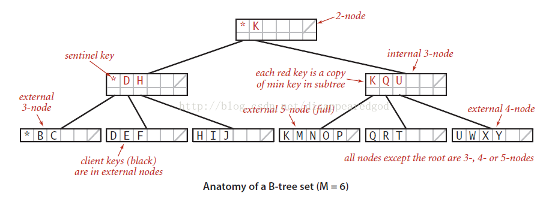
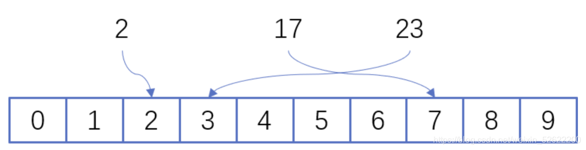

# 1.1.1随处可见的红黑树

### 红黑树特点

红黑树(Red Black Tree)是一种**自平衡二叉搜索树**(二叉查找树)，是一种特殊的二叉搜索树，在进行插入和删除时通过特定操作保持二叉树自身的平衡，从而获得较高的查找性能。

红黑树的平衡操作通过左旋、右旋和变色来实现，平衡的过程是比较复杂的，但通过平衡操作，可以获得更高效的性能。对二叉搜索树进行平衡后，最坏情况的运行时间得到优化，可以在O(logN)的时间复杂度内完成查找、插入和删除，**N是二叉搜索树中的节点数**。

#### 二叉搜索树是一种特殊的二叉树，具有如下特性：

1. 如果二叉树的左子树不为空，则左子树上所有节点的值均小于它的根节点的值。
2. 如果二叉树的右子树不为空，则右子树上所有节点的值均大于它的根节点的值。
3. 如果独立地看，左子树、右子树也分别为二叉搜索树。

#### 红黑树的特性

1. 节点是红色或黑色。

2. 根节点是黑色。

3. 所有叶子节点都是黑色的空节点。(叶子节点是NIL节点或NULL节点)

4. 每个红色节点的两个子节点都是黑色节点。(从每个叶子节点到根的所有路径上不能有两个连续的红色节点)

5. 从任一节点到其每个叶子节点的所有路径都包含相同数目的黑色节点。

### 红黑树的应用

1. 广泛用于**C++**的STL中，**map和set**都是用红黑树实现的。
2. 著名的linux**进程调度CFS**(Completely Fair Scheduler)，用红黑树管理进程控制块，进程的虚拟内存区域都存储在一颗红黑树上，每个虚拟地址区域都对应红黑树的一个节点,左指针指向相邻的地址虚拟存储区域，右指针指向相邻的高地址虚拟地址空间。
3. **IO多路复用epoll的实现**采用红黑树组织管理sockfd，以支持快速的增删改查。
4. **ngnix**中，用红黑树管理**timer**，因为红黑树是有序的，可以很快的得到距离当前最小的定时器。
5. **java**中**TreeMap**和**TreeSet**的实现。

#### 进程调度cfs

##### 基本原理：

设定一个调度周期(sched_latency_ns)，目标是让每个进程在这个周期内至少有机会运行一次，换一种说法就是每个进程等待CPU的时间最长不超过这个调度周期；然后根据进程的数量，大家平分这个调度周期内的CPU使用权，由于进程的[优先级](https://so.csdn.net/so/search?q=%E4%BC%98%E5%85%88%E7%BA%A7&spm=1001.2101.3001.7020)即nice值不同，分割调度周期的时候要加权；每个进程的累计运行时间保存在自己的vruntime字段里，哪个进程的vruntime最小就获得本轮运行的权利。

##### **Q：新进程的vruntime的初值是不是0？**

假如新进程的vruntime初值为0的话，比老进程的值小很多，那么它在相当长的时间内都会保持抢占CPU的优势，老进程就要饿死了，这显然是不公平的。所以CFS是这样做的：每个CPU的运行队列cfs_rq都维护一个min_vruntime字段，记录该运行队列中所有进程的vruntime最小值，新进程的初始vruntime值就以它所在运行队列的min_vruntime为基础来设置，与老进程保持在合理的差距范围内。参见后面的源代码。

##### **新进程的vruntime初值的设置与两个参数有关：**

sched_child_runs_first：规定fork之后让子进程先于父进程运行;

sched_features的START_DEBIT位：规定新进程的第一次运行要有延迟。

#### 内存管理


## 红黑树的数学证明与推导

下面通过"数学归纳法"开始论证"高度为h的红黑树，它的包含的内节点个数至少为 2^bh(x)-1个"。

**(01) 当树的高度h=0时，**

内节点个数是0，bh(x) 为0，2^bh(x)-1 也为 0。显然，原命题成立。


**(02) 当h>0，且树的高度为 h-1 时，它包含的节点个数至少为 2^bh(x)-1-1。这个是根据(01)推断出来的！**

下面，由树的高度为 h-1 的已知条件推出“树的高度为 h 时，它所包含的节点树为 2^bh(x)-1”。

当树的高度为 h 时，
对于节点x(x为根节点)，其黑高度为bh(x)。
对于节点x的左右子树，它们黑高度为 bh(x) 或者 bh(x)-1。
根据(02)的已知条件，我们已知 "x的左右子树，即高度为 h-1 的节点，它包含的节点至少为 2^bh(x)-1-1 个"；

所以，节点x所包含的节点至少为 ( 2^bh(x)-1-1 ) + ( 2^bh(x)-1-1 ) + 1 = 2^bh(x)-1。即节点x所包含的节点至少为 2^bh(x)-1。
因此，原命题成立。

由(01)、(02)得出，"高度为h的红黑树，它的包含的内节点个数至少为 2^bh(x)-1个"。
因此，“一棵含有n个节点的红黑树的高度至多为2log(n+1)”。

## 手撕红黑树的左右旋转

### 红黑树的旋转和变色

#### 旋转

左旋右旋是相反的，可逆的。

##### 左旋：

以某个节点作为支点(旋转节点)，其右子节点变为旋转节点的父节点，右子节点的左子节点变为旋转节点的右子节点，旋转节点的左子节点保持不变。右子节点的左子节点相当于从右子节点上“断开”，重新连接到旋转节点上。

###### 代码实现

```c
void rbtree_left_rotate(rbtree *T, rbtree_node *x) {
 
	rbtree_node *y = x->right;  // x  --> y  ,  y --> x,   right --> left,  left --> right
 
	x->right = y->left; //1 1
	if (y->left != T->nil) { //1 2
		y->left->parent = x;
	}
 
	y->parent = x->parent; //1 3
	if (x->parent == T->nil) { //1 4
		T->root = y;
	} else if (x == x->parent->left) {
		x->parent->left = y;
	} else {
		x->parent->right = y;
	}
 
	y->left = x; //1 5
	x->parent = y; //1 6
}
```

##### 右旋：

以某个节点作为支点(旋转节点)，其左子节点变为旋转节点的父节点，左子节点的右子节点变为旋转节点的左子节点，旋转节点的右子节点保持不变。左子节点的右子节点相当于从左子节点上“断开”，重新连接到旋转节点上。

###### 代码实现

```c
void rbtree_right_rotate(rbtree *T, rbtree_node *y) {
 
	rbtree_node *x = y->left;
 
	y->left = x->right;
	if (x->right != T->nil) {
		x->right->parent = y;
	}
 
	x->parent = y->parent;
	if (y->parent == T->nil) {
		T->root = x;
	} else if (y == y->parent->right) {
		y->parent->right = x;
	} else {
		y->parent->left = x;
	}
 
	x->right = y;
	y->parent = x;
}
```

#### 变色

将节点的颜色由红变黑或由黑变红。向红黑树中插入节点时，**新节点的颜色都设置为红色**。不管新节点是什么颜色，特性3都不可能被破坏，特性1、2、4都有可能被破坏。如果插入的节点是黑色，则一定会破坏特性5，需要进行调整，如果插入的节点是红色，则一定不会破坏特性5。所以将新节点设置为红色，可以降低破坏红黑树特性的可能性。

#### 综合案例


1. 在红黑树中插入节点20，插入后不满足红黑树的特性4。


2.将节点18从红色变成黑色，变色后不满足红黑树的特性5。


3.以节点18作为旋转节点，进行左旋，左旋后还是不满红黑树的特性5。


4.将节点10从黑色变成红色，变色后，重新满足了红黑树的5条特性。


## 红黑树添加的实现与添加三种情况的证明

### 代码实现

```c
void rbtree_insert_fixup(rbtree *T, rbtree_node *z) {
 
	while (z->parent->color == RED) { //z ---> RED
		if (z->parent == z->parent->parent->left) {
			rbtree_node *y = z->parent->parent->right;
			if (y->color == RED) {
				z->parent->color = BLACK;
				y->color = BLACK;
				z->parent->parent->color = RED;
 
				z = z->parent->parent; //z --> RED
			} else {
 
				if (z == z->parent->right) {
					z = z->parent;
					rbtree_left_rotate(T, z);
				}
 
				z->parent->color = BLACK;
				z->parent->parent->color = RED;
				rbtree_right_rotate(T, z->parent->parent);
			}
		}else {
			rbtree_node *y = z->parent->parent->left;
			if (y->color == RED) {
				z->parent->color = BLACK;
				y->color = BLACK;
				z->parent->parent->color = RED;
 
				z = z->parent->parent; //z --> RED
			} else {
				if (z == z->parent->left) {
					z = z->parent;
					rbtree_right_rotate(T, z);
				}
 
				z->parent->color = BLACK;
				z->parent->parent->color = RED;
				rbtree_left_rotate(T, z->parent->parent);
			}
		}
		
	}
 
	T->root->color = BLACK;
}
```


增加一个节点，**节点颜色默认为红色**，对红黑树进行**二分查找**，对比，直至整个红黑树的叶子节点，确定当前节点插入红黑树的初始位置（插入节点初始位置为整个红黑树的叶子节点）

1. **判断插入节点是否为根节点，如果是根节点** 

   把当前节点置为根节点，并把颜色置为黑色

2. **判断父节点的颜色，如果父节点的颜色为黑色** 

   不用处理，不违反红黑树的性质

3. **父节点是红色，叔叔节点也是红色** 

   1. 将父节点和叔叔节点设置为黑色，祖父节点设置为红色 
   2. 以祖父节点为插入节点，在进行判断

4. **父节点是红色，叔叔节点是黑色**

   1. **左左插入**

      父节点变成黑色，祖父节点变成红色，祖父节点右旋

   2. **左右插入**

      父节左旋，之后父节点就变成了子节点
      按照父节点为当前插入的红色节点，进行左左插入处理

   3. **右右插入**

      父节点变成黑色，祖父节点变成红色，祖父节点左旋

   4. **右左插入**

      父节点右旋，之后父节点变成了子节点
      按照父节点为当前插入的红色节点，进行右右插入处理

## 红黑树删除的实现与删除四种情况的证明

### 代码实现

```c
void rbtree_delete_fixup(rbtree *T, rbtree_node *x) {
 
	while ((x != T->root) && (x->color == BLACK)) {
		if (x == x->parent->left) {
 
			rbtree_node *w= x->parent->right;
			if (w->color == RED) {
				w->color = BLACK;
				x->parent->color = RED;
 
				rbtree_left_rotate(T, x->parent);
				w = x->parent->right;
			}
 
			if ((w->left->color == BLACK) && (w->right->color == BLACK)) {
				w->color = RED;
				x = x->parent;
			} else {
 
				if (w->right->color == BLACK) {
					w->left->color = BLACK;
					w->color = RED;
					rbtree_right_rotate(T, w);
					w = x->parent->right;
				}
 
				w->color = x->parent->color;
				x->parent->color = BLACK;
				w->right->color = BLACK;
				rbtree_left_rotate(T, x->parent);
 
				x = T->root;
			}
 
		} else {
 
			rbtree_node *w = x->parent->left;
			if (w->color == RED) {
				w->color = BLACK;
				x->parent->color = RED;
				rbtree_right_rotate(T, x->parent);
				w = x->parent->left;
			}
 
			if ((w->left->color == BLACK) && (w->right->color == BLACK)) {
				w->color = RED;
				x = x->parent;
			} else {
 
				if (w->left->color == BLACK) {
					w->right->color = BLACK;
					w->color = RED;
					rbtree_left_rotate(T, w);
					w = x->parent->left;
				}
 
				w->color = x->parent->color;
				x->parent->color = BLACK;
				w->left->color = BLACK;
				rbtree_right_rotate(T, x->parent);
 
				x = T->root;
			}
 
		}
	}
 
	x->color = BLACK;
}
```


		删除节点时，先看删除节点的颜色，再看兄弟节点的颜色，再看侄子节点的颜色（先看远侄子，再看近侄子）最后看父节点的颜色
		当前节点->兄弟节点->远侄子节点->近侄子节点->父节点
		（补充）删除节点分两种情况，一种是叶子节点，一种不是叶子节点，如果不是叶子节点，进行和子节点值的交换，直至节点没有叶子节点，变成删除叶子节点
	      1、删除的是叶子节点，并且叶子节点为红色
	          直接删除，不需要后续处理
	      2、删除的是叶子节点，并且叶子节点为黑色
	          需要处理
	      3、删除节点下有一个子节点
	          将当前删除的节点和子节点的值进行交换，就变成了删除叶子节点
	          3.1、如果叶子节点是红色，对应情况1，直接删除
	          3.2、如果叶子节点是黑色，对应情况2，进行后续处理
	      4、删除节点有两个子节点
	          将当前节点和后续节点中的一个节点值进行交换，改为删除叶子节点
	          4.1、没有叶子节点
	              对应情况1、2
	          4.2、有一个叶子节点
	              对应情况3
	          4.2、有两个叶子节点
	              对应情况4
		经过上述步骤的转换，将情况转换为删除叶子节点，其中叶子节点为红色的已经处理过，现在只需要考虑，删除叶子节点为黑色的情况
	        5、删除的叶子节点为黑色
	            5.1、删除节点的兄弟节点为红色
	                删除节点为左节点：
	                    将父节点和兄弟节点颜色互换，对父节点进行左旋
	                删除节点为右节点：
	                    将父节点和兄弟节点颜色互换，对父节点进行右旋
	            5.2、删除节点兄弟节点为黑色，远侄子节点为红色
	                删除节点为左节点：
	                    这时删除节点的远侄子节点为兄弟节点的右节点
	                    将父节点和兄弟节点颜色对调，并把远侄子节点变成黑色，对父节点进行左旋
	                    删除当前需要删除的节点
	                删除节点为右节点：
	                    这时删除节点的远侄子节点为兄弟节点的左节点
	                    将父节点和兄弟节点颜色对调，并把远侄子节点变成黑色，对父节点进行右旋
	                    删除当前需要删除的节点
	            5.3、删除节点兄弟节点是黑色，远侄子节点是红色
	                删除节点为左节点：
	                    近侄子节点和兄弟节点颜色互换，并将近侄子节点进行右旋
	                    这时候就变成了5.2情况
	                删除节点为右节点：
	                    近侄子节点和兄弟节点颜色互换，将近侄子节点进行左旋
	                    这时候就变成了5.2情况
	            5.4、父节点是红色，兄弟节点和兄弟节点的两个孩子（只能是空节点）都是黑色的情况
	                将父节点变成黑色，兄弟节点变成红色
	                删除当前节点
	            5.5、父节点和兄弟节点及兄弟节点的两个子节点，都是黑色
	                将兄弟节点变成红色，删除节点
	                这样删除节点后，父节点的左右两个黑色节点数就相等了，但是经过祖父节点的路径黑色节点
	                的数就少1个，这个时候，我们再以父节点为起始节点（不用删除节点了），继续根据情况进行
	                平衡操作，在看是哪种情况，在进行对应的调整，这样一直向上，直到新的起始节点为根节点
## 红黑树的线程安全的做法

在应用红黑树的时候，如果多个线程在操作红黑树时，需要考虑红黑树的线程安全问题。

考虑加锁，判断在加锁的情况下数据的处理是否复杂，如果复杂可以考虑应用粒度大的锁（互斥锁），如果数据处理不复杂，可以选用粒度较小的自旋锁。可以对整棵树加锁，也可以针对某个需要操作的子树进行加锁。

## 分析红黑树工程实用的特点

红黑树对于内存存储需要经常遍历来说，选用红黑树存储是可行的，其查找索引的时间复杂度是log2(n),方便遍历。平衡二叉树在数据量变大之后，有可能退化成链表，查询效率就会大大降低，至O(n)。


# 1.1.2 磁盘存储链式的B树与B+树

## 磁盘结构分析与数据存储原理

磁盘是一种直接存取的存储设备，又称随机存取存储设备。它的每个物理记录都有确定的位置和唯一的地址。它包括多个用于存储数据的盘片。每个盘片有一个读写磁头，所有的读写磁头都固定在唯一个磁盘臂上同时移动。


在一个盘片上的读写磁头的轨迹成为磁道，读写磁头下的所有磁道组成的圆柱体称为一个柱面，一个磁道又被划分成一个或多个物理块，这些物理块称为扇区。因此可以得出硬盘的存储容量，计算公式：存储容量 = 磁头数x磁道（柱面）数x每道扇区数x每扇区字节数

磁盘I/O的实际操作细节取决于计算机系统、操作系统及I/O通道和磁盘控制器硬件的特性。文件的信息通常不是记录在同一盘片的各个磁道上，而是记录在同一柱面的不同磁道上这样可以使磁盘臂的移动次数减少，缩短存取信息的时间。为了访问磁盘上的一个物理记录，必须给出三个参数：柱面号、磁道号、扇区号。扇区是硬盘上存储的物理单位，现在每个扇区可存储 512 字节数据已经成了业界的约定。也就是说，即使计算机只需要某一个字节的数据，但是也得把这个 512 个字节的数据全部读入内存，再选择所需要的那个字节。

### 磁盘寻址方式

#### CHS

产生了所谓的CSH 3D参数(Disk Geometry)。即磁头数(Heads)，在面数(Cylinders)，扇区数(Sectors)，以及相应CHS寻址方式。

CHS寻址模式将硬盘划分为磁头 (Heads) 、柱面(Cylinder)、扇区(Sector)。

磁头(Heads)每张磁片的正反两各有一个磁头，一个磁头对应一张磁片的一个面。因此，用第几磁头就可以表示数据在哪个磁面。

柱面(Cyinder):所有磁片中半径相同的同心磁道构成“柱面”，意思是这一系列的磁道垂直叠在一起，就形成一个柱面的形状。简单地理解，柱面数=磁道数。

扇区(Sector):将磁道划分为若干个小的区段，就是扇区。虽然很小，但实际是一个扇子的形状，故称为扇区。每个扇区的容量为512字节。

**CHS寻址方式的容量由CHS三个参数决定：**

磁头数最大为255(用8个二进制位存)。从0开始编号。

柱面数最大为1023(用10 个二进制位存储)。从0开始编号。

扇区数最大数63(用6个二进制位存储)。从1始编号。

所以CHS寻址方式的最大寻址范围为:

255\*1023*63\*512/1048576 = 7.837 GB(1M =1048576 Bytes)
或硬盘厂商常用的单位:
255\*1023*63\*512/1000000 =8.414 GB(1M=1000000 Bytes)

#### LBA

LBA(Logical Block Addressing)逻辑块寻址模式。在LBA地址中，地址不再表示实际硬盘的实际物理地址(柱面、磁头和扇区)。LBA编址方式将 CHS这种三维寻址方式转变为一维的线性寻址，它把硬盘所有的物理扇区的C/H/S编号通过一定的规则转变为线性的编号，系统效率得到大大提高，避免了 烦琐的磁头/柱面/扇区的寻址方式。在访问硬盘时，由硬盘控制器再这种逻辑地址转换为实际硬盘的物理地址。
LARGE 大硬盘模式，在硬盘的柱面超过 1024 而又不为 LBA 支持时采用。LARGE 模式采用的方法是把柱面数除以 2，把磁头数乘以2，其结果总容量不变。


## 多叉树的运用以及B树的定义证明

###### 【可以看看2-3-4树】

树的高度是命中查找的一个不可抗拒的时间下限。在一定的数据条件下，树的高度和宽度是互相制约的。最简单的二叉树，尽管容易实现，却不能有实际的价值。其最最令人发指的二叉树的高度太高。n叉树的提出和实现解决了二叉树的不足，典型的n叉树有：2-3-4树/红黑树/B树。

### B树定义

是一种树状数据结构，它能够存储数据、对其进行排序并允许以O(log n)的时间复杂度运行进行**查找**、**顺序读取**、**插入**和**删除**的数据结构。B树，概括来说是一个节点可以拥有多于2个子节点的二叉查找树。与自平衡二叉查找树不同，B树为系统最优化大块数据的读和写操作。B-tree算法减少定位记录时所经历的中间过程，从而加快存取速度。普遍运用在数据库和文件系统。



### 性质

- 每个点最多有n个孩子
- 每个非叶子节点（根节点除外）最多有n/2(向上取整)到n个孩子
- root至少有2个子树，除非root的孩子是叶子节点
- k个孩子的非叶子节点含有k-1个键值
- 所有的叶子节点都在同一层，并且内部节点不携带任何信息。（B树的阶指最大子节点数。优势，n阶的B树节点定义为有k个键值和k+1个指针，其中n<=k<=2n，用于指定最少的子节点数）

**注意**：根结点为叶子节点，整棵树只有一个根节点。


### 好处

1. 在数据库查询中，以树存储数据。树有多少层，就意味着要读多少次磁盘IO。

   所以树的高度越矮，就意味着查询数据时，需要读IO的次数就越少。（众所周知，读IO是一件费事的操作）

   当数据量大的时候，用AVL树存的话，就算AVL是平衡树，但是也扛不住数据量大，数据量大，AVL树的树高肯定很高，那么读取数据的IO次数也会多。那么有没有办法能压缩AVL树的树高呢？这时候B树就出来了。B树的一个结点可以装多个值，读取时，是把整个结点读到内存，然后在内存中，对结点的值进行处理，在内存中处理速度肯定比磁盘快。所以只要树的高度低，IO少，就能够提升查询效率，这是B树的好处之一。


2. B树的每一个结点都包含key(索引值) 和 value(对应数据)，因此方位离根结点近的元素会更快速。（相对于B+树）


## B树插入的两种分裂

根据B树的性质，当插入数据，节点的数据个数到达M个时(超过上限)，需要进行分裂。

**分裂：分裂出一个兄弟节点，分出一半的关键字给兄弟节点。中位数插入父节点。如果父节点不存在，创建一个父节点，再插入。【细节：兄弟节点不仅要拷贝关键字，还需要将对应孩子节点拷贝。】**

在添加key的时候，分裂有两种情况：

1. 只有根节点的时候，1分裂三个节点
2. 其余的情况下，1分裂两个节点


## B树删除的前后借位与节点合并

## 手撕B树的插入、删除、遍历、查找

## B+树的定义与实现

## B+树叶子节点的前后指针

## B+树的应用场景与应用场景

文件系统和数据库系统中常用的B/B+ 树，他通过对每个节点存储个数的扩展，使得对连续的数据能够进行较快的定位和访问，能够有效减少查找时间，提高存储的空间局部性从而减少IO操作。他广泛用于文件系统及数据库中，如：

- Windows：HPFS 文件系统
- Mac：HFS，HFS+ 文件系统
- Linux：ResiserFS，XFS，Ext3FS，JFS 文件系统
- 数据库：ORACLE，MYSQL，SQLSERVER 等中

## B+树的线程安全做法

# 1.1.3 海量数据去重的Hash与BloomFilter，bitmap

## hash的原理与hash函数

### 原理

f()（哈希函数）完成了索引值到实际地址的映射，这就让数组可以快速完成基于索引值的查找。然而，数组的局限性在于，它只能基于数据的索引去查找，而不能基于数据的数值去查找。

哈希表的设计采用了 **函数映射** 的思想，将记录的存储位置与记录的关键字关联起来。这样的设计方式，能够根据记录的关键字快速定位到想要查找的记录，而且不需要与表中存在的记录的关键字比较后再来进行查找（比如二分查找）。

哈希表的核心思想就是实现了“数据地址 = f (关键字)”的映射关系，这样就可以快速完成基于数据的数值的查找了。

- 总结一下

  **数组实现了“地址 = f (index)”的映射关系。字典实现“地址 = f (关键字)”的映射关系**

### 优点

- 在查找方面，哈希表完成了关键字到地址的映射，可以在常数级时间复杂度内通过关键字查找到数据。
- 它可以提供非常快速的插入-删除-查找操作，无论多少数据，插入和删除只需要接近常量的时间。

### 缺点

- 哈希表中的数据是没有顺序概念的，所以不能以一种固定的方式（比如从小到大）来遍历其中的元素。在数据处理顺序敏感的问题时，选择哈希表并不是个好的处理方法。
- 哈希表中的 key 是不允许重复的，在重复性非常高的数据中，哈希表也不是个好的选择。

### hash函数

哈希函数就是将键转化为数组索引的过程,这个函数应该易于计算且能够均与分布所有的键。

**Hash 函数设计的好坏会直接影响到对哈希表的操作效率。**

哈希函数能使对一个数据序列的访问更加迅速有效，通过散列函数，数据元素将被更快定位。

**设计原则：**

1. 哈希函数的定义域必须包括需要存储的全部关键码，而如果散列表允许有m个地址时，其值域必须在0到m-1之间
2. 哈希函数计算出来的地址能均匀分布在整个空间中
3. 哈希函数应该比较简单

**一些常用的设计哈希函数的方法：**

- 直接定址法

  取关键字或关键字的某个线性函数值为散列地址。即hash(k) = k或者hash(k) = a*k + b，a、b为常数

- 数字分析法

  假设关键字集合中的每个关键字 key 都是由 s 位数字组成（k1,k2,…,Ks），从中提取分布均匀的若干位组成哈希地址。上面张一、张二、张三、张四的手机号信息存储，就是使用的这种方法。

## hash冲突和解决冲突

### hash冲突

对于两个数据元素的关键字a1和a2，且a1！=a2，但有 Hash（a1）== Hash（a2），即：不同关键字通过相同哈希哈数计算出相同的哈希地址，该种现象称为哈希冲突或哈希碰撞。

把具有不同关键码而具有相同哈希地址的数据元素称为“同义词”。

### 解决冲突

**分离链接法**

是将散列到同一个值的所有元素保留在一个表中，为方便起见，这些表都有表头。如果空间很紧，则更可取的方法是避免使用这些表头。

**开放定址法**

如果有冲突发生，那么就要尝试选择另外的单元，知道找出空的单元为止。更一般地，单元h0(X),h1(X),h2(X),...，相继是选，其中hi(X) = (Hash(X)+F(i)) mod TableSize，且F(0) = 0。函数F是冲突解决方法。因为所有的数据都要置入表内，所以开放定址散列法所需要的表要比分离链接散列用的表大。

> **线性探测：** 从发生冲突的位置开始，依次向后探测，直到寻找到下一个空位置为止。
>
> **二次探测：** H_i = (H_0 ± i^2)%m，其中i = 1,2,3,..., H_0是通过散列函数Hash(x)对元素的		关键码 key进行计算得到的位置，m是表的大小。


## hash的应用场景

安全加密，唯一标识，数据校验，散列函数，负载均衡，数据分片，分布式存储。

**安全加密**

第一点很好理解，加密的目的就是防止原始数据泄露，所以很难通过哈希值反向推导原始数据，这是一个最基本的要求。所以我着重讲一下第二点。实际上，不管是什么哈希算法，我们只能尽量减少碰撞冲突的概率，理论上是没办法做到完全不冲突的。存储数据的容器是有限的，数据则是庞大的。

**唯一标识**

我们知道，任何文件在计算机中都可以表示为二进制串。我们可以给文件取一个唯一标识，或者说信息摘要。比如，我们可以从图片的二进制码串开头取 100 个字节，从中间取 100 个字节，从最后再取 100 个字节，然后将这 300 个字节放到一块，通过哈希算法（比如 MD5），得到一个哈希字符串，用它作为图片的唯一标识。通过这个唯一标识来判定图片是否在图库中。

如果还想继续提高效率，我们可以把每个图片的唯一标识，和相应的图片文件在图库中的路径信息，都存储在散列表中。当要查看某个图片是不是在图库中的时候，我们先通过哈希算法对这个图片取唯一标识，然后在散列表中查找是否存在这个唯一标识。

如果不存在，那就说明这个图片不在图库中；如果存在，我们再通过散列表中存储的文件路径，获取到这个已经存在的图片，跟现在要插入的图片做全量的比对，看是否完全一样。如果一样，就说明已经存在；如果不一样，说明两张图片尽管唯一标识相同，但是并不是相同的图片。

**数据校验**

电驴类似的BT下载软件（基于P2P协议）。我们从多个机器上并行下载一个 2GB 的电影，这个电影文件可能会被分割成很多文件块（比如可以分成 100 块，每块大约 20MB）。等所有的文件块都下载完成之后，再组装成一个完整的电影文件就行了。

我们知道，网络传输是不安全的，下载的文件块有可能是被宿主机器恶意修改过的，又或者下载过程中出现了错误，所以下载的文件块可能不是完整的。如果我们没有能力检测这种恶意修改或者文件下载出错，就会导致最终合并后的电影无法观看，甚至导致电脑中毒。现在的问题是，如何来校验文件块的安全、正确、完整呢？

我们通过哈希算法，对 100 个文件块分别取哈希值，并且保存在种子文件中。我们在前面讲过，哈希算法有一个特点，对数据很敏感。只要文件块的内容有一丁点儿的改变，最后计算出的哈希值就会完全不同。所以，当文件块下载完成之后，我们可以通过相同的哈希算法，对下载好的文件块逐一求哈希值，然后跟种子文件中保存的哈希值比对。如果不同，说明这个文件块不完整或者被篡改了，需要再重新从其他宿主机器上下载这个文件块。

**散列函数**

散列函数是设计一个散列表的关键。它直接决定了散列冲突的概率和散列表的性能。不过，相对哈希算法的其他应用，散列函数对于散列算法冲突的要求要低很多。即便出现个别散列冲突，只要不是过于严重，我们都可以通过开放寻址法或者链表法解决。

不仅如此，散列函数对于散列算法计算得到的值，是否能反向解密也并不关心。散列函数中用到的散列算法，更加关注散列后的值是否能平均分布，也就是，一组数据是否能均匀地散列在各个槽中。除此之外，散列函数执行的快慢，也会影响散列表的性能，所以，散列函数用的散列算法一般都比较简单，比较追求效率。

**负载均衡**



如上图所示，这里其实是分了10张表，openid计算后的hash值取模10，得到对应的分表，在进行后续处理就好。对于一般的活动或者系统，我们一般设置10张表或者100张表就好。

下面我们来看一点复杂的问题，假设我们活动初始分表了10张，运营一段时间以后发现需要10张不够，需要改到100张。这个时候我们如果直接扩容的话，那么所有的数据都需要重新计算Hash值，大量的数据都需要进行迁移。如果更新的是缓存的逻辑，则会导致大量缓存失效，发生雪崩效应，导致数据库异常。造成这种问题的原因是hash算法本身的缘故，只要是取模算法进行处理，则无法避免这种情况。针对这种问题，我们就需要利用一致性hash进行相应的处理了。

一致性hash的基本原理是将输入的值hash后，对结果的hash值进行2^32取模，这里和普通的hash取模算法不一样的点是在一致性hash算法里将取模的结果映射到一个环上。将缓存服务器与被缓存对象都映射到hash环上以后，从被缓存对象的位置出发，沿顺时针方向遇到的第一个服务器，就是当前对象将要缓存于的服务器，由于被缓存对象与服务器hash后的值是固定的，所以，在服务器不变的情况下，一个openid必定会被缓存到固定的服务器上，那么，当下次想要访问这个用户的数据时，只要再次使用相同的算法进行计算，即可算出这个用户的数据被缓存在哪个服务器上，直接去对应的服务器查找对应的数据即可。这里的逻辑其实和直接取模的是一样的。如下图所示：


初始情况如下：用户1的数据在服务器A里，用户2、3的数据存在服务器C里，用户4的数据存储在服务器B里

下面我们来看一下当服务器数量发生变化的时候，相应影响的数据情况：

**服务器缩容**


服务器B发生了故障，进行剔除后，只有用户4的数据发生了异常。这个时候我们需要继续按照顺时针的方案，把缓存的数据放在用户A上面。

**服务器扩容**


同样的，我们进行了服务器扩容以后，新增了一台服务器D，位置落在用户2和3之间。按照顺时针原则，用户2依然访问的是服务器C的数据，而用户3顺时针查询后，发现最近的服务器是D，后续数据就会存储到d上面。

**虚拟节点**


实际使用中，由于服务器节点数量有限，有可能出现分布不均匀的情况。这个时候会出现大量数据都被映射到某一台服务器的情况，如下图左侧所示。为了解决这个问题，我们采用了虚拟节点的方案。虚拟节点是实际节点（实际的物理服务器）在hash环上的复制品，一个实际节点可以对应多个虚拟节点。虚拟节点越多，hash环上的节点就越多，数据被均匀分布的概率就越大。如右图所示，B、C、D 是原始节点复制出来的虚拟节点，原本都要访问机器D的用户1、4，分别被映射到了B,D。通过这样的方式，起到了一个服务器均匀分布的作用。

## 分布式hash的实现原理

如上【负载均衡】

## 海量数据去重布隆过滤器

### 基本概念

实际上是一个很长的二进制向量和一系列随机映射函数。主要用于判断一个元素是否在一个集合中。

通常我们会遇到很多要判断一个元素是否在某个集合中的业务场景，一般想到的是将集合中所有元素保存起来，然后通过比较确定。链表、树、散列表（又叫哈希表，Hash table）等等数据结构都是这种思路。但是随着集合中元素的增加，我们需要的存储空间也会呈现线性增长，最终达到瓶颈。同时检索速度也越来越慢，上述三种结构的检索时间复杂度分别为O ( n ) ，O(logn)，O(1)。

这个时候，布隆过滤器（Bloom Filter）就应运而生。

### 原理

布隆过滤器是由一个固定大小的二进制向量或者位图（bitmap）和一系列映射函数组成的。在初始状态时，对于长度为 m 的位数组，它的所有位都被置为0，如下图所示：


当有变量被加入集合时，通过 K 个映射函数将这个变量映射成位图中的 K 个点，把它们置为 1。


查询某个变量的时候我们只要看看这些点是不是都是 1 就可以大概率知道集合中有没有它了

- 如果这些点有任何一个 0，则被查询变量一定不在；
- 如果都是 1，则被查询变量很可能存在。为什么说是可能存在，而不是一定存在呢？那是因为映射函数本身就是散列函数，散列函数是会有碰撞的。

### 误判率

布隆过滤器的误判是指多个输入经过哈希之后在相同的bit位置1了，这样就无法判断究竟是哪个输入产生的，因此误判的根源在于相同的 bit 位被多次映射且置 1。这种情况也造成了布隆过滤器的删除问题，因为布隆过滤器的每一个 bit 并不是独占的，很有可能多个元素共享了某一位。如果我们直接删除这一位的话，会影响其他的元素。

### 特性

- 一个元素如果判断结果为存在的时候元素不一定存在，但是判断结果为不存在的时候则一定不存在。
- 布隆过滤器可以添加元素，但是不能删除元素。因为删掉元素会导致误判率增加。

### **添加元素步骤**：

1. 将要添加的元素给 k 个哈希函数
2. 得到对应于位数组上的 k 个位置
3. 将这k个位置设为 1

### 查询元素步骤：

1. 将要查询的元素给k个哈希函数

2. 得到对应于位数组上的k个位置
3. 如果k个位置有一个为 0，则肯定不在集合中
4. 如果k个位置全部为 1，则可能在集合中‘

### 优点：

相比于其它的数据结构，布隆过滤器在空间和时间方面都有巨大的优势。布隆过滤器存储空间和插入/查询时间都是常数 O ( K ) O(K)O(K)，另外，散列函数相互之间没有关系，方便由硬件并行实现。布隆过滤器不需要存储元素本身，在某些对保密要求非常严格的场合有优势。且布隆过滤器可以表示全集，其它任何数据结构都不能；

### 缺点：

布隆过滤器的缺点和优点一样明显。误算率是其中之一。随着存入的元素数量增加，误算率随之增加。但是如果元素数量太少，则使用散列表足矣。另外，一般情况下不能从布隆过滤器中删除元素。我们很容易想到把位数组变成整数数组，每插入一个元素相应的计数器加 1, 这样删除元素时将计数器减掉就可以了。然而要保证安全地删除元素并非如此简单。首先我们必须保证删除的元素的确在布隆过滤器里面。这一点单凭这个过滤器是无法保证的。另外计数器回绕也会造成问题。在降低误算率方面，有不少工作，使得出现了很多布隆过滤器的变种。

### 使用场景：

如网页 URL 去重、垃圾邮件识别、大集合中重复元素的判断和缓存穿透等问题。

布隆过滤器的典型应用有：

- **数据库防止穿库。** Google Bigtable，HBase 和 Cassandra 以及 Postgresql 使用BloomFilter来减少不存在的行或列的磁盘查找。避免代价高昂的磁盘查找会大大提高数据库查询操作的性能。
- 业务场景中判断用户**是否阅读过某视频或文章**，比如抖音或头条，当然会导致一定的误判，但不会让用户看到重复的内容。
- **缓存宕机、缓存击穿场景**，一般判断用户是否在缓存中，如果在则直接返回结果，不在则查询db，如果来一波冷数据，会导致缓存大量击穿，造成雪崩效应，这时候可以用布隆过滤器当缓存的索引，只有在布隆过滤器中，才去查询缓存，如果没查询到，则穿透到db。如果不在布隆器中，则直接返回。
- **WEB拦截器**，如果相同请求则拦截，防止重复被攻击。用户第一次请求，将请求参数放入布隆过滤器中，当第二次请求时，先判断请求参数是否被布隆过滤器命中。可以提高缓存命中率。Squid 网页代理缓存服务器在 cache digests 中就使用了布隆过滤器。Google Chrome浏览器使用了布隆过滤器加速安全浏览服务。
- **Venti 文档存储系统**也采用布隆过滤器来检测先前存储的数据。
- **SPIN 模型检测器**也使用布隆过滤器在大规模验证问题时跟踪可达状态空间。

### 拓展：布谷鸟过滤器

为了解决布隆过滤器不能删除元素的问题，布谷鸟过滤器横空出世。布谷鸟过滤器用更低的空间开销解决了布隆过滤器不能删除元素的问题，做到了更好的效果：

- 支持动态的添加和删除元素

- 提供了比传统布隆过滤器更高的查找性能，即使在接近满的情况下（比如空间利用率达到 95% 的时候）
- 比起商过滤器它更容易实现
- 如果要求误判率低于3%，它比布隆过滤器有更低的空间开销

相比布谷鸟过滤器而言布隆过滤器有以下不足：查询性能弱、空间利用效率低、不支持反向操作（删除）以及不支持计数，具体如下：

- 删除不完美，存在误删的概率。删除的时候知识删除了一份指纹副本，并不能确定此指纹副本是要删除的key的指纹。同时这个问题也导致了假阳性的情况。
- 插入复杂度比较高。随着插入元素的增多，复杂度会越来越高，因为存在桶满，踢出的操作，所以需要重新计算，但综合来讲复杂度还是常数级别。
- 存储空间的大小必须为2的指数的限制让空间效率打了折扣。
- 同一个元素最多插入kb次，（k指哈希函数的个数，b指的桶中能装指纹的个数也可以说是桶的尺寸大小）如果布谷鸟过滤器支持删除，则必须存储同一项的多个副本。 插入同一项kb+1次将导致插入失败。 这类似于计数布隆过滤器，其中重复插入会导致计数器溢出。


## 布隆过滤的数学推导和证明


