# 1.2.1 创建型设计模式

## 单例模式

### 概念

单例模式是指在整个系统[生命周期](https://so.csdn.net/so/search?q=%E7%94%9F%E5%91%BD%E5%91%A8%E6%9C%9F&spm=1001.2101.3001.7020)内，保证一个类只能产生一个实例，确保该类的唯一性。

### 为什么需要单例模式

单例模式是为了保证程序的线程安全。

**什么是线程安全？**
在拥有共享数据的多条线程并行执行的程序中，线程安全的代码会通过同步机制保证各个线程都可以正常且正确的执行，不会出现数据污染等意外情况。

**如何保证线程安全？**

- 给共享的资源加把锁，保证每个资源变量每时每刻至多被一个线程占用。
- 让线程也拥有资源，不用去共享进程中的资源。如：使用threadlocal可以为每个线程维护一个私有的本地变量。

### 分类

单例模式可以分为 **懒汉式** 和 **饿汉式** ，两者之间的区别在于创建实例的时间不同。

**懒汉式**
系统运行中，实例并不存在，只有当需要使用该实例时，才会去创建并使用实例。这种方式**要考虑线程安全**。

**饿汉式**
系统一运行，就初始化创建实例，当需要时，直接调用即可。这种方式**本身就线程安全，没有多线程的线程安全问题。**

### 特点

- 构造函数和析构函数为私有类型，目的是禁止外部构造和析构。
- 拷贝构造函数和赋值构造函数是私有类型，目的是禁止外部拷贝和赋值，确保实例的唯一性。
- 类中有一个获取实例的静态方法，可以全局访问。


## 工厂方法模式

### 定义

定义一个用于创建对象的接口，让子类决定实例化哪一个类， Factory Method使一个类的实例化延迟到其子类。

### 应用场景

- 客户端不知道他所需要的对象的类；
- 需要将类的实例延迟到子类中实现，并且一类产品有许多形态；

### UNL

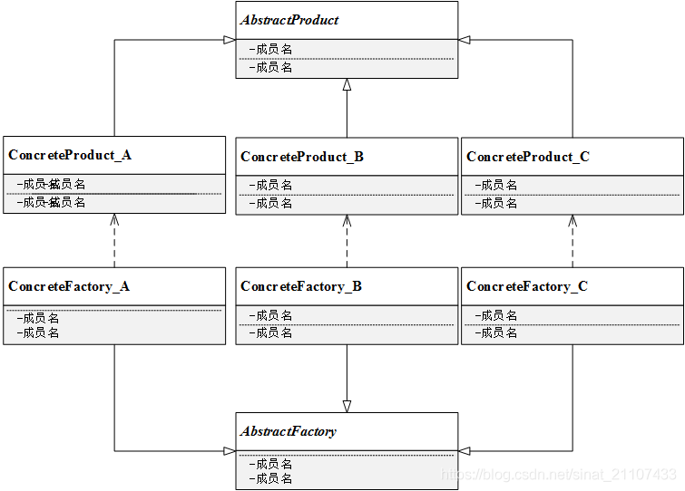

### 代码

```c++
//
// Created by 84030 on 2022/12/19.
//


#include<iostream>
using namespace std;

// 客户端使用creator对象

// 抽象产品

class Product{
public:
    virtual ~Product(){}
    virtual void Operation() = 0;

};

// 具体产品A
class ConcreteProductA : public Product {
public:
    void Operation() override { cout<< "ConcreteProductA"<<endl;}
};

// 具体产品B
class ConcreteProductB : public Product{
public:
    void Operation() override { cout<<"ConcreteProductB"<<endl;}
};

// 抽象工厂
class Creator{
public:
    // some op
    void Operator(){
        Product *p = this->FactoryMethod();
        if(p != nullptr){
            p->Operation();
            delete p;
        }
    }

    virtual ~Creator(){}

private:
    // 工厂方法
    virtual Product *FactoryMethod() = 0;
};

class ConcreteCreatorA : public Creator{
protected:
    Product *FactoryMethod() override {return new ConcreteProductA();}
};

class ConcreteCreatorB : public Creator{
protected:
    Product *FactoryMethod() override {return new ConcreteProductB();}
};

int main(){
    Creator *cA = new ConcreteCreatorA();
    if(cA != nullptr){
        cA->Operator();
        delete cA;
    }

    Creator *cB = new ConcreteCreatorB();
    if(cB != nullptr){
        cB->Operator();
        delete cB;
    }

    return 0;
}
```

## 建造者模式

### 概念

建造者模式，将一个复杂对象的构建与它的表示分离，使得同样的构建过程可以创建不同的表示。

### UML
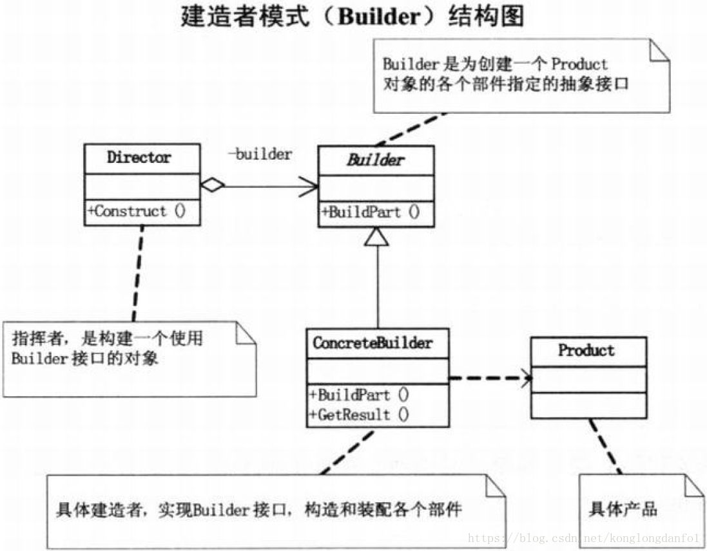

简单理解就是Builder中定义了创建Product各个部分的接口。ConcreteBuilder中具体实现了创建Product中的各个部分的接口，就是具体的建造者。Director是根据用户的需求构建Product的（具体怎么构建，怎么把Product中的各个部件构建起来。）该模式主要用于创建一些复杂的对象，这些兑现内部构建的建造顺序通常是稳定的，但对象内部的构建通常面临着复杂的变化。

说到这里建造者模式具体实现的功能与模板方法模式有点类似。比如可以有不同得ConcreteBuilder类实现不同得创建方式。这样从应用上模板方法模式和建造者模式实现的功能是很相似的。但是建造者模式的侧重点是在于Director的不同，可以有不同的呈现方式，而模板方法模式的侧重点是算法中每一步实现的不同。另外，它们的类之间的关系是不同的。模板方法是通过继承的方式来实现的，而建造者模式是通过组合的方式实现的。模板方法模式主要用于执行不同的算法，建造者模式主要用于构建对象。不过者两种模式其实都可以实现很多相似的功能。这也没什么，本来同样的功能的实现方式也是多种多样的。主要看需求。另外在实际写程序的时候也不必拘泥于某种设计模式，只要遵守相关的原则，使整个程序高效、稳定、易扩展、易维护就行。两者使用的场景也有区别。

### 代码

```c++
// build.h
#ifndef CPP_BUILDER_H
#define CPP_BUILDER_H

#include<iostream>
#include<vector>
#include<string>
using namespace std;
// 产品类
class Product{
public:
    void Add(string str){
        m_vec.push_back(str);
    }
    void Show(){
        for(auto it = m_vec.begin(); it != m_vec.end(); it++){
            cout<< *it <<endl;
        }
    }

private:
    vector<string> m_vec;
};

// 建造者类
class Builder{
public:
    virtual void BuildA() = 0;
    virtual void BuildB() = 0;
    virtual void BuildC() = 0;
    virtual Product getResult() = 0;

};

class ConcreteBuilder_0 : public  Builder{
public:
    ConcreteBuilder_0() : m_p(nullptr){
        m_p = new Product();
    }

    virtual ~ConcreteBuilder_0(){
        if(m_p == nullptr)
                delete m_p;
    }

    virtual  void BuildA(){
        string str = "Builder_0 BuildA";
        m_p->Add(str);
    }

    virtual  void BuildB(){
        string str = "Builder_0 BuildB";
        m_p->Add(str);
    }

    virtual  void BuildC(){
        string str = "Builder_0 BuildC";
        m_p->Add(str);
    }

    Product getResult(){
        return *m_p;
    }

private:
    Product * m_p;
};

class ConcreteBuilder_1 : public  Builder{
public:
    ConcreteBuilder_1() : m_p(nullptr){
        m_p = new Product();
    }

    virtual ~ConcreteBuilder_1(){
        if(m_p == nullptr)
            delete m_p;
    }

    virtual  void BuildA(){
        string str = "Builder_1 BuildA";
        m_p->Add(str);
    }

    virtual  void BuildB(){
        string str = "Builder_1 BuildB";
        m_p->Add(str);
    }

    virtual  void BuildC(){
        string str = "Builder_1 BuildC";
        m_p->Add(str);
    }

    Product getResult(){
        return *m_p;
    }

private:
    Product * m_p;
};

// 指挥者类
class Director{
public:
    // 具体怎么实现根据需求
    void build(Builder *p){
        p->BuildA();
        p->BuildB();
        p->BuildC();
    }
};

#endif //CPP_BUILDER_H

```

```c++
// build.cpp
#include"./inc/builder.h"

int main(){
    Builder *builder = new ConcreteBuilder_0();
    Director * director = new Director();
    director->build(builder);
    builder->getResult().Show();

    delete builder;
    builder = new ConcreteBuilder_1();
    director->build(builder);
    builder->getResult().Show();

    return 0;
}
```

## 抽象工厂模式

### 概念
抽象工厂模式是所有形态的工厂模式中最为抽象和最具一般性的。抽象工厂模式可以向 客户端提供一个接口，使得客户端在不必指定产品的具体类型的情况下，能够创建多个产品族的产品对象。

### 为什么使用抽象工厂模式
抽象工厂方法是针对与一个产品族，使得易于交换产品系列，只需改变具体的工厂就可以使用不同的产品配置。当一个族中的产品对象被设计成一起工作且一个应用只是用同一族的对象，例如设计系统生成不同风格的UI界面，按钮，边框等UI元素在一起使用，并且只能同属于一种风格，这很容易使用抽象工厂实现。

### 实现步骤
1. 提供一个抽象工厂类：声明一组创建一族产品的工厂方法

2. 提供一个具体工厂类：实现了在抽象工厂创建产品的工厂方法

3. 提供一个抽象产品类：抽象产品中声明了产品具有的业务方法

4. 提供一个具体产品类：实现抽象产品接口中声明的业务方法


抽象工厂中需要提供创建大量不同产品的接口，例如创建产品 A、创建产品 B，对于产品 A 和产品 B 来说，可以由不同的工厂产生，工厂 1 产生一种品牌的 A 产品和 B 产品，工厂 2 同样也可以生产 A 产品和 B 产品

### UML
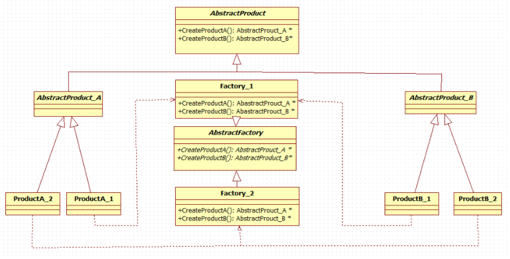

### 代码

```c++
#include<iostream>
using namespace std;
#if 1

// 抽象产品
class Product{
public:
    virtual void Show() = 0;
};

// 抽象产品族1 生产键盘
class KeyBoard:public Product{};

// 具体产品
class LogiKB: public KeyBoard{
public:
    void Show(){
        cout<<"logi keyboard..."<<endl;
    }
};

class RazerKB:public KeyBoard{
public:
    void Show(){
        cout<<"razer keyboard..."<<endl;
    }
};

// 抽象产品2 生产鼠标
class Mouse: public Product{};

class LogiM : public  Mouse{
public:
    void Show(){
        cout<<"logi mouse..."<<endl;
    }
};

class RazerM : public Mouse{
public:
    void Show(){
        cout<<"razer mouse..."<<endl;
    }
};

// 抽象工厂
class Factory{
public:
    // 创建一个键盘
    virtual KeyBoard * CreateKeyBoard() = 0;
    // 创建一个鼠标
    virtual Mouse * CreateMouse() = 0;
};

// 具体工厂 不同工厂生产不同品牌外设
class LogiFactory: public Factory{
public:
    KeyBoard * CreateKeyBoard(){
        return new LogiKB;
    }

    Mouse * CreateMouse(){
        return new LogiM;
    };
};

class RazerFactory : public Factory{
public:
    KeyBoard * CreateKeyBoard(){
        return new RazerKB;
    }

    Mouse * CreateMouse(){
        return new RazerM;
    };
};

int main(){
    Factory * factory = new LogiFactory;
    KeyBoard * keyBoard = factory->CreateKeyBoard();
    Mouse * mouse = factory->CreateMouse();
    keyBoard->Show();
    mouse->Show();

    // 释放
    delete factory;
    delete keyBoard;
    delete mouse;

    factory = new RazerFactory;
    keyBoard = new RazerKB;
    mouse = new RazerM;
    keyBoard->Show();
    mouse->Show();

    delete factory;
    delete keyBoard;
    delete mouse;

    return 0;

}
#endif
```

### 优缺点
#### 优点
- 抽象工厂封装了变化，封装了对象创建的具体细节

- 增加新的产品族很方便，无须修改已有系统

- 针对接口进行编程而不是针对具体进行编程


#### 缺点
- 增加新的产品等级结构需对原系统做较大修改(违背开放封闭)


## 原型模式
### 概念
用原型实例指定创建对象的种类，并且通过拷贝这些原型创建新的对象。
### 为什么使用
原型模式和建造者模式、工厂方法模式一样，都属于创建型模式的一种。简单的来说，我们使用原型模式，就是为了创建对象。但是，在以下场景下，使用原型模式是最好的选择：

当我们的对象类型不是开始就能确定的，而这个类型是在运行期确定的话，那么我们通过这个类型的对象克隆出一个新的对象比较容易一些；
有的时候，我们需要一个对象在某个状态下的副本，此时，我们使用原型模式是最好的选择；例如：一个对象，经过一段处理之后，其内部的状态发生了变化；这个时候，我们需要一个这个状态的副本，如果直接new一个新的对象的话，但是它的状态是不对的，此时，可以使用原型模式，将原来的对象拷贝一个出来，这个对象就和之前的对象是完全一致的了；
当我们处理一些比较简单的对象时，并且对象之间的区别很小，可能就几个属性不同而已，那么就可以使用原型模式来完成，省去了创建对象时的麻烦了；
有的时候，创建对象时，构造函数的参数很多，而自己又不完全的知道每个参数的意义，就可以使用原型模式来创建一个新的对象，不必去理会创建的过程，让创建过程见鬼去吧。
所以，在上述的的情况下，在设计的时候，适当的考虑一下原型模式，减少对应的工作量，减少程序的复杂度，提高效率。

### UML
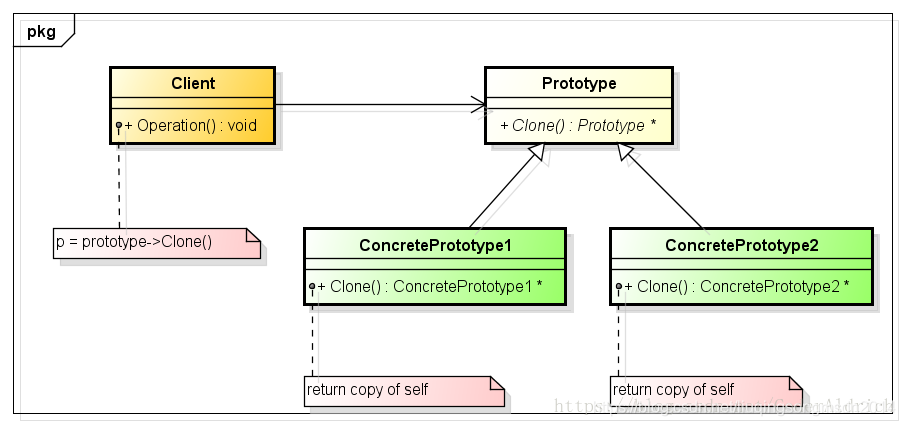
由于克隆需要一个原型，而上面的类图中Prototype就这个原型，Prototype定义了克隆自身的Clone接口，由派生类进行实现，而实现原型模式的重点就在于这个Clone接口的实现。ConcretePrototype1类和ConcretePrototype2类继承自Prototype类，并实现Clone接口，实现克隆自身的操作；同时，在ConcretePrototype1类和ConcretePrototype2类中需要重写默认的复制构造函数，供Clone函数调用，Clone就是通过在内部调用重写的复制构造函数实现的。在后续的编码过程中，如果某个类需要实现Clone功能，就只需要继承Prototype类，然后重写自己的默认复制构造函数就好了。好比在C#中就提供了ICloneable接口，当某个类需要实现原型模式时，只需要实现这个接口的道理是一样的。

### 代码
```c++
#include <iostream>
#if 1
using namespace std;

// interface
class Prototype{
public:
    Prototype(){}
    virtual ~Prototype(){}

    virtual Prototype* Clone() = 0;
};

// realize
class ConcretePrototype : public Prototype{
public:
    ConcretePrototype():m_counter(0){}
    virtual ~ConcretePrototype(){}

    ConcretePrototype(const ConcretePrototype &rhs){
        m_counter = rhs.m_counter;
    }

    virtual ConcretePrototype *Clone(){
        // 调用拷贝构造函数
        return new ConcretePrototype(*this);
    }

private:
    int m_counter;
};

int main(){
    // 生成对象
    ConcretePrototype * conProA = new ConcretePrototype();


    // 复制自身
    ConcretePrototype * conProB = conProA->Clone();

    cout<<"ca addr is = "<<&conProA<<endl;
    cout<<"cb addr is = "<<&conProB<<endl;

    delete conProA;
    conProA = nullptr;

    delete conProB;
    conProB = nullptr;

    return 0;
}


#endif

```

### 与其他创造型模式的比较
工厂方法模式、抽象工厂模式、建造者模式和原型模式都是创建型模式。工厂方法模式适用于生产较复杂，一个工厂生产单一的一种产品的时候；抽象工厂模式适用于一个工厂生产多个相互依赖的产品；建造者模式着重于复杂对象的一步一步创建，组装产品的过程，并在创建的过程中，可以控制每一个简单对象的创建；原型模式则更强调的是从自身复制自己，创建要给和自己一模一样的对象。

### 总结
原型模式作为创建型模式中最特殊的一个模式，具体的创建过程，是由对象本身提供，这样我们在很多的场景下可以很方便的快速的构建新的对象。但是，原型模式的最大缺点是继承原型的子类都要实现Clone操作，这个是很困难的。例如，当所考虑的类已经存在时就难以新增Clone操作。当内部包括一些不支持拷贝或者有循环引用的对象时，实现克隆可能也会很困难。说以说，每一种设计模式都有它的优点和缺点，在设计的时候，我们需要进行权衡各方面的因素，扬长避短。


# 1.2.2 结构型设计模式

## 适配器模式

### 定义
适配器模式将一个类的接口，转换成客户期望的另一个接口。适配器让原本接口不兼容的类可以合作无间。
### 意义
在于将某些功能与第三方需求接口适配对接，且避免第三方接口与功能代码过多耦合。
在设计初初，不要考虑使用此模式。仅在功能完善，需要实现第三方接口时，没必要迎合第三方的需求对原来的设计大动刀戈，可以尝试使用适配器模式。
多用于想应用某些功能，但是功能类的接口与需求的接口不兼容时，采用适配器模式来解决。主要应用在以下场景：

- 
  新旧接口兼容
  软件版本升级，部分旧接口还在被使用。需要保留旧的接口，增加新接口，使两者兼容。

- 
  第三方接口的适配
  在系统功能稳定的情况下，有第三方新的接口需求需要对接。

- 
  统一多个类相同功能的接口
  例如统一不同类型数据库的访问接口。

### UML
#### 类适配器

1. 使用继承的适配器
2. 这一实现使用了继承机制： 适配器同时继承两个对象的接口。 请注意， 这种方式仅能在支持多重继承的编程语言中实现， 例如 C++。

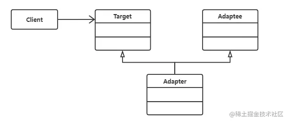
- Target: 客户端期望接口类

- Adaptee: 实际需要的功能类

- Adapter: 将接口类与功能类衔接的适配器类

- Client: 客户端代码

#### 对象适配器

1. 使用委托的适配器
2. 实现时使用了构成原则： 适配器实现了其中一个对象的接口， 并对另一个对象进行封装。 所有流行的编程语言都可以实现适配器。

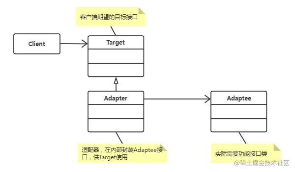

- Target: 客户端期望接口类
- Adaptee: 实际需要的功能类

- Adapter: 将接口类与功能类衔接的适配器类

- Client: 客户端代码

### code
```c++
// classAdapter


#include <iostream>
using namespace std;
#if 1
/* Connect Usb port*/
class UsbDisk{
public:
    virtual ~UsbDisk(){}

    virtual void ConnectDevice(){
        cout<<"Connect usb port"<<endl;
    }
};

/* Connect Type-c port */
class TypeCInterface{
public:
    virtual ~TypeCInterface(){}

    void ConnectDevice(){
        cout<<"Connect Type-C port."<<endl;
    }
};

/* Not only connext Usb port, but also connect Type-C port */
class Adapter : public UsbDisk, public TypeCInterface{
public:
    void ConnectDevice(){
        TypeCInterface::ConnectDevice();
    }
};

int main(){
    UsbDisk *usbDisk = new Adapter();
    usbDisk->ConnectDevice();

    delete usbDisk;
    return 0;
}
#endif
```

```c++
/* ObjectAdapter */

#include<iostream>
#if 1
using namespace std;
/* Connect Usb port */
class UsbDisk{
public:
    virtual ~UsbDisk(){}

    virtual void ConnectDevice(){
        cout<<"Connect usb port"<<endl;
    }
};

/* Connect Type-C port*/
class TypeCInterface{
public:
    virtual ~TypeCInterface(){}

    void ConnectDecvice(){
        cout<<"Connect Type-C port"<<endl;
    }
};

/* Usb device connect phone */
class Adapter : public UsbDisk{
private:
    TypeCInterface *m_Adapter;
public:
    Adapter(){
        m_Adapter = new TypeCInterface();
    }

    ~Adapter(){
        if(m_Adapter != NULL){
            delete m_Adapter;
        }
    }

    void ConnectDevice(){
        if(m_Adapter != NULL){
            m_Adapter->ConnectDecvice();
        } else{
            cout<<"Adapter abnormal. Connect fail!"<<endl;
        }
    }
};

int main(){
    UsbDisk *usbDisk = new Adapter();

    usbDisk->ConnectDevice();
    delete usbDisk;
    return 0;
}

#endif
```

```c++
#include<iostream>
using namespace std;
#if 1

class Duck{
public:
    virtual void quack(){
        cout<<"gua gua"<<endl;
    }

    virtual void fly(){
        cout<<"i am flying a long distance"<<endl;
    }
};

class Turkey{
public:
    virtual void gooble(){
        cout<<"ga ga"<<endl;
    }

    virtual void fly(){
        cout<<"i am flying a short distance"<<endl;
    }
};

class TurkeyAdapater: public Duck{
private:
    Turkey * m_turkey;
public:
    TurkeyAdapater(Turkey * turkey):m_turkey(turkey){}

    virtual void quack(){
        m_turkey->gooble();
    }

    virtual void fly(){
        for(auto i = 0; i < 5; i++){
            m_turkey->fly();
        }
    }
};

int main(){
    Duck * duck = new Duck();
    Turkey * turkey = new Turkey();
    Duck * turkeyAdapter = new TurkeyAdapater(turkey);

    cout<<"duck: "<<endl;
    duck->quack();
    duck->fly();
    cout<<endl;

    cout<<"turkey: "<<endl;
    turkey->gooble();
    turkey->fly();
    cout<<endl;

    cout<<"turkeyAdapter: "<<endl;
    turkeyAdapter->quack();
    turkeyAdapter->fly();
    cout<<endl;

    delete duck;
    delete turkey;
    delete turkeyAdapter;

    return 0;
}

#endif
```

```c++
#include<iostream>
#include<memory>
#include<string>

#if 1
class Target{
public:
    virtual bool NewRequest(const int value){
        std::cout<<"Calling new request method!"<<std::endl;
        return true;
    }
    virtual ~Target(){}
};

class Adaptee{
public:
    bool OldRequest(const std::string &strValue){
        std::cout<<"Calling old request method!"<<std::endl;
        return true;
    }
};


class Adaptor :public Target{
private:
    std::shared_ptr<Adaptee> m_smartAdaptee;
public:
    Adaptor(std::shared_ptr<Adaptee> adaptee){
        m_smartAdaptee = std::move(adaptee);
    }

    bool NewRequest(const int value){
        std::cout<<"I am new request method"<<std::endl;
        std::string strValue = std::to_string(value);
        m_smartAdaptee->OldRequest(strValue);

        return true;
    }

};

int main(){
    std::shared_ptr<Target> target(new Adaptor(std::make_shared<Adaptee>()));
    target->NewRequest(1);

    return 0;
}

#endif
```

### 总结

- 适配器模式主要原理: 在于实现客户接口时，关联上已存在的功能接口。一种使用过多继承方式，一种通过类之间依赖的方式，都能实现。
- 为统一多个功能相同的类接口时，类适配器模式是更适合的。比较典型的例子如，MySql和SQLServer等多种类型数据库的访问接口的统一。
- 在软件开发初，无第三方需求接口的情况下，不要考虑此模式的使用。往往适配器模式的使用，会让代码看起来像一个补丁，修修补补。
- **「适配器模式」**看起来与**「外观模式」**相似，都是与外部对接。其实有很大不同: **「外观模式」**是定义一套新的接口，而**「适配器模式」**则是运用已有的接口。**「外观模式」**是在已有复杂的接口上，再封一层简单的接口，方便客户端使用。**「适配器模式」**则是结合已有的功能，实现或重载已经存在的客户端接口。

## 装饰器模式
### 概念
- 装饰器模式是一种结构型设计模式,实现了在不改变现有对象结构的的同时又拓展了新的功能；
- 装饰器本质上是对现有对象的重新包装，同时装饰器又称为封装器；
### UML
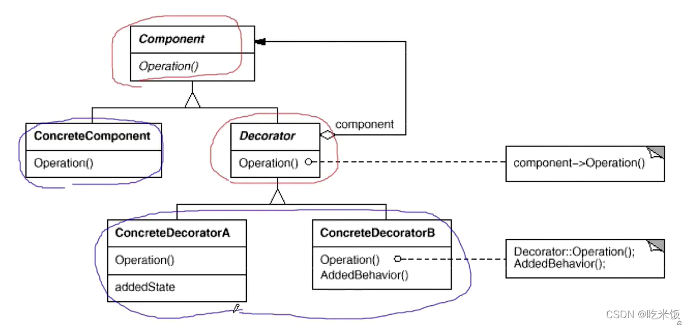

### code
```c++
#include<iostream>
#include<memory>
using namespace std;
#if 1

class Phone{
public:
    virtual ~Phone() {}
    virtual void ShowFunction() = 0;
};

class xiaomi : public Phone{
public:
    void ShowFunction(){ cout<<"This is XiaoMi Mobile Phone."<<endl;}
};

class vivo : public Phone{
public:
    void ShowFunction(){ cout<<"This is Vivo Mobile Phone."<<endl;}
};

class iphone : public Phone{
public:
    void ShowFunction(){ cout<<"This is iPhone Mobile Phone."<<endl;}
};

/* 5G */
class Decorator_5G : public Phone{
public:
    Decorator_5G(shared_ptr<Phone> phone) : m_phone(phone){}
    void ShowFunction(){
        m_phone->ShowFunction();
        cout<<"Function: 5G"<<endl;
    }

private:
    shared_ptr<Phone> m_phone;
};

/* take photo */
class Decorator_Camera : public Phone{
public:
    Decorator_Camera(shared_ptr<Phone> phone):m_phone(phone){}
    void ShowFunction(){
        m_phone->ShowFunction();
        cout<<"Function: Camera"<<endl;
    }

private:
    shared_ptr<Phone> m_phone;
};

/* Cloud Service */
class Decorator_CloudService : public Phone{
public:
    Decorator_CloudService(shared_ptr<Phone> phone):m_phone(phone){}
    void ShowFunction(){
        m_phone->ShowFunction();
        cout<<"Function: Cloud Service"<<endl;
    }

private:
    shared_ptr<Phone> m_phone;
};

int main(){

    /* at first, only three phone */
    shared_ptr<Phone> xm = make_shared<xiaomi>();
    shared_ptr<Phone> vv = make_shared<vivo>();
    shared_ptr<Phone> ip = make_shared<iphone>();

    /* functions decoratored by xiaomi */
    shared_ptr<Phone> mi_decorate = make_shared<Decorator_5G>(xm);
    mi_decorate                   = make_shared<Decorator_Camera>(mi_decorate);
    mi_decorate->ShowFunction();
    cout<<endl;

    /* functions decoratored by vivo */
    shared_ptr<Phone> vv_decorate = make_shared<Decorator_Camera>(vv);
    vv_decorate->ShowFunction();
    cout<<endl;

    /* functions decoratored by iPhone */
    shared_ptr<Phone> ip_decorate = make_shared<Decorator_Camera>(ip);
    ip_decorate = make_shared<Decorator_5G>(ip_decorate);
    ip_decorate = make_shared<Decorator_CloudService>(ip_decorate);
    ip_decorate->ShowFunction();
    cout<<endl;

    return 0;

}
#endif

/*
This is XiaoMi Mobile Phone.
Function: 5G
Function: Camera

This is Vivo Mobile Phone.
Function: Camera

This is iPhone Mobile Phone.
Function: Camera
Function: 5G
Function: Cloud Service
*/
```

### 优缺点
#### 优点
- 单一职责，每个类只负责自己的功能
- 通过装饰类拓展功能，无需创建新的子类，就实现了对原有功能的拓展
- 可以通过不同的装饰类组合拓展多个新功能
- 可以在运行时添加或删除某些装饰类的功能

#### 缺点
- 给原有类装饰的新功能，很难不按照装饰的顺序栈执行
- 运行时删除某些装饰类很麻烦
- 多层装饰会让代码变得难以理解

### 与其他模式的比较
- 装饰器就是对派生类写法的一种优化方向，一定程度上可以避免代码的无限膨胀。

- 和适配器模式相比，装饰器模式可以在不改变对象接口的前提下，拓展新功能，并且可以递归组合，这个是适配器无法实现的
- 装饰器模式和组合模式很像，但装饰器是给被装饰对象拓展新的功能，而组合模式则是对原有的对象不同的叶子节点进行求和。组合对象不修改原有方法调用，重点是在组织不同子对象；装饰者模式在确保只有一个子对象的同时，又对调用执行的方法进行了拓展。

## 代理模式
### 概念
给某一个对象提供一个代理，并由代理对象控制对原对象的引用。（为其他对象提供一种代理以控制这个对象的访问）
### UML
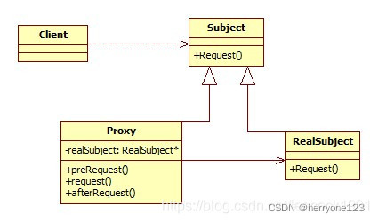
（1）Subject（抽象主题角色）：声明了真实主题和代理主题的共同接口，这样一来在任何使用真实主题的地方都可以使用代理主题，客户端通常需要针对抽象主题角色进行编程。
（2）Proxy（代理主题角色）：代理主题角色通过关联关系引用真实主题角色，因此可以控制和操纵真实主题对象；代理主题角色中提供一个与真实主题角色相同的接口（以在需要时代替真实主题角色），同时还可以在调用对真实主题对象的操作之前或之后增加新的服务和功能；
（3）RealSubject（真实主题角色）：定义了代理角色所代表的真实对象，在真实主题角色中实现了真实的业务操作，客户端可以通过代理主题角色间接调用真实主题角色中定义的操作。

### code
```c++
#include <iostream>
#if 1
using namespace std;
/* 抽象主题角色 */
class subject{
public:
    virtual void Request() = 0;
};
/* 真实主题角色 */
class Consubject : public subject{
public:
    void Request(){  /* 实现了在抽象主题角色中定义的方法 */
        cout<<"Consubject"<<endl;
    }
};

/* 代理主题角色 */
class Proxy{
private:
    subject *m_sub;

public:
    Proxy(){}
    Proxy(subject *sub) : m_sub(sub){};  /* 代理主题角色中定义了一个真实主题角色对象 */
    ~Proxy() {
        if(m_sub != nullptr){
            delete m_sub;
        }
    }
    void Request(){
        /* 代理主题角色也实现了抽象主题角色的方法 */
        cout<<"Proxy REQ"<<endl;
        m_sub->Request();
    }
};

int main(){
    subject * sub = new Consubject();  /* 真实主题角色对象 */
    Proxy *p = new Proxy(sub);
    p->Request();

    return 0;
}

#endif

/*
Proxy REQ
Consubject
*/
```
### 优缺点
#### 优点
- 代理模式能够将客户与真正被调用的对象分离（协调调用者与被调用者），降低了耦合度；

- 客户端可以通过代理与多个目标对象交互，目标对象的修改和扩展客户端并不感知，扩展性和维护性强

- 各种代理模式：
  - 远程代理：使得客户端可以访问在远程机上的对象，远程机可以具有更好的计算性能与处理速度，可以快速相应并处理客户端请求；
  - 虚拟代理：可以使用一个小对象来代表一个大对象，可以减少系统资源的消耗，对系统进行优化并提高运行速度；
  - 保护代理：可以控制对真实对象的使用权限；

#### 缺点
- 在客户端和真正目标对象之间增加代理对象，请求速度有可能会变慢；

- 增加代理会使系统复杂度变高;

### 应用场景
- 代理服务器，通过代理服务器访问无法访问的服务器；

- 可以在代理服务器实现负载均衡、数据缓存；

- 常见的代理模式
  - 远程代理（Remote）：为一个位于不同的地址空间的对象提供一个本地的代理对象，这个不同的地址空间可以是同一台主机中，也可以是在另一台主机中；
  - 虚拟代理（Virtual）:如果需要创建一个资源消耗比较大的对象，先创建一个消耗相对较小的对象来表示，真实对象只有需要时才会被真正创建；
    - 如打开网页时，先看到文字，比较大的图片一张张下载。
  - 保护代理（Protect or Access）,控制对一个对象的访问，可以给不同的用户提供不同级别的使用权限。
  - 其他的代理：缓冲代理、防火墙代理、同步化代理。

## 外观模式

### 前言

在实际开发时，面对一个大的系统，总是会将一个大的系统分成若干个子系统，等子系统完成之后，再分别调用对应的子系统来完成对应的整体功能，这样有利于降低系统的复杂性；最终进行实现某个具体的功能时，我们将对应的子系统进行组合就好了；但是，子系统那么多，关系那么复杂，组合形成一个完整的系统，是存在难度的。

我们在使用visual studio进行编译C++代码时，你只是在菜单中选择了Build，然后visual studio就开始了一堆的编译工作；你应该知道，因为你的一个简单的Build动作，编译器在后台会进行语法分析，生成中间代码，生成汇编代码，链接成可执行程序或库等等动作；而这一切，作为只是开发程序的我们，而不用去理解编译器在做什么的，编译器向我们隐藏了背后的一系列复杂操作，而只提供一个Build按钮，这个Build按钮，就可以执行一切的操作；当单击这个Build按钮时，Build在幕后，将任务分发给不同的子系统去完成，最终子系统进行协作完成了整个的编译任务。而这样隐藏一些复杂操作，只提供一个更高层的统一接口，就是我今天总结的外观模式。

### 概念

外观模式，很多人也把它叫做门面模式。在GOF的《设计模式:可复用面向对象软件的基础》一书中对外观模式是这样说的：将子系统中的一组接口提供一个一致的界面，外观模式定义了一个高层接口，这个接口使得这一子系统更加容易使用。细细的理解这句话；子系统中的一组接口，就好比上面举得例子中的语法分析，生成中间代码，生成汇编代码，链接成可执行程序或库；外观模式定义的一个高层接口，就好比上面说的Build按钮，通过这样的一个Build按钮，让编译器更加容易使用，对于这一点，从Linux C++/C转Windows C++/C的程序员是最有体会的。visual studio提供的强大功能，只需要一个Build按钮，就可以进行Build动作，而不需要去写makefile文件，然后再去执行一些命令进行编译。

### UML

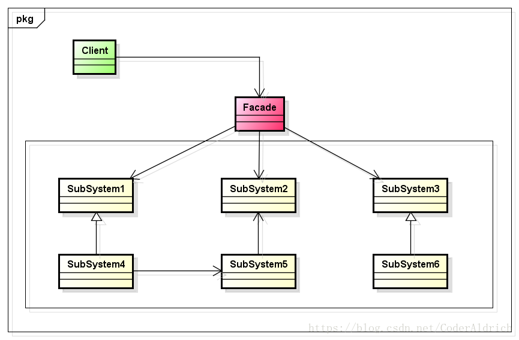

**Facade:**知道哪些子系统类负责处理请求，并且将客户的请求代理给适当的子系统对象；

**SubSystem:**实现子系统具体的功能；处理由Facade对象指派的任务；但是，SubSystem没有Facade的任何相关信息，也就是说，没有指向Facade的指针。

Client通过发送请求给Facade的方式与子系统进行通信，而不直接与子系统打交道，Facade将这些消息转发给适当的子系统对象。尽管是子系统中的有关对象在做实际工作，但Facade模式本身也必须将它的接口转换成子系统的接口，这里是不是有点适配器模式的感觉呢？这就是学习结构型设计模式的感觉，感觉都很相似，但是仔细的去研究时，就会发现各自的用处。

### code

```c++
#include<iostream>
using namespace std;
#if 1

/* 语法分析子系统 */
class syntax_parser{
public:
    void syntaxparser(){
        cout<<"syntax_parser"<<endl;
    }
};

/* 生成中间代码子系统 */
class gen_mid_code{
public:
    void genmidcode(){
        cout<<"gen_mid_code"<<endl;
    }
};

/* 生成汇编代码子系统 */
class gen_assembly_code{
public:
    void genassemblycode(){
        cout<<"gen_assembly_code"<<endl;
    }
};

/* 链接生成可执行应用程序或库子系统 */
class link_system{
public:
    void linksystem(){
        cout<<"link_system"<<endl;
    }
};

class Facade{
public:
    void Compile(){
        syntax_parser sp;
        sp.syntaxparser();
        gen_assembly_code gsc;
        gsc.genassemblycode();
        gen_mid_code gmc;
        gmc.genmidcode();
        link_system ls;
        ls.linksystem();

    }
};

int main(){
    Facade facade;
    facade.Compile();
    return 0;
}
#endif

/*
syntax_parser
gen_assembly_code
gen_mid_code
link_system
*/
```

```c++
#include <iostream>
using namespace std;
#if 1
namespace facade
{
    //图形相关类
    class graphic
    {
        //-------------单件类实现相关begin--------------
    private:
        graphic(){};
        graphic(const graphic &tmpobj);
        graphic &operator=(const graphic &tmpobj);
        ~graphic(){};

    public:
        static graphic &getInstance()
        {
            static graphic instance;
            return instance;
        }
        //-------------单件类实现相关end--------------

    public:
        void display(bool enable) //是否全屏显示（true：是）
        {
            cout << "图形->是否全屏显示->" << enable << endl;
            //其他代码略......
        }
        void effect(bool enable) //是否开启特效（true：是）
        {
            cout << "图形->是否开启特效->" << enable << endl;
        }
        void resolution(int index) //设置窗口分辨率
        {
            cout << "图形->分辨率设置选项->" << index << endl;
        }
        void antialiasing(bool enable) //是否开启抗锯齿（true：是）
        {
            cout << "图形->是否开启抗锯齿->" << enable << endl;
        }
        //....其他接口略
    };

    //声音相关类
    class sound
    {
        //-------------单件类实现相关begin--------------
    private:
        sound(){};
        sound(const sound &tmpobj);
        sound &operator=(const sound &tmpobj);
        ~sound(){};

    public:
        static sound &getInstance()
        {
            static sound instance;
            return instance;
        }
        //-------------单件类实现相关end--------------

    public:
        void bgsound(bool enable) //是否开启背景声音（true：是）
        {
            cout << "声音->是否开启背景声音->" << enable << endl;
        }
        void envirsound(bool enable) //是否开启环境音效（true：是）
        {
            cout << "声音->是否开启环境音效->" << enable << endl;
        }
        void expsound(bool enable) //是否开启表情声音（true：是）
        {
            cout << "声音->是否开启表情声音->" << enable << endl;
        }
        void setvolume(int level) //音量大小设置（0-100）
        {
            cout << "声音->音量大小为->" << level << endl;
        }
        //......其他接口略
    };

    //语音聊天相关类
    class chatvoice
    {
        //-------------单件类实现相关begin--------------
    private:
        chatvoice(){};
        chatvoice(const chatvoice &tmpobj);
        chatvoice &operator=(const chatvoice &tmpobj);
        ~chatvoice(){};

    public:
        static chatvoice &getInstance()
        {
            static chatvoice instance;
            return instance;
        }
        //-------------单件类实现相关end--------------

    public:
        void micvolume(int level) //麦克风音量大小设置（0-100）
        {
            cout << "语音聊天->麦克风音量大小为->" << level << endl;
        }
        void micsens(int level) //麦克风灵敏度设置（0-100）
        {
            cout << "语音聊天->麦克风灵敏度为->" << level << endl;
        }
        void chatvolume(int level) //聊天音量设置（0-100）
        {
            cout << "语音聊天->聊天音量为->" << level << endl;
        }
        //......其他接口略
    };
    //-----------------------
    //扮演外观模式角色的类
    class conffacade
    {
        //-------------单件类实现相关begin--------------
    private:
        conffacade(){};
        conffacade(const conffacade &tmpobj);
        conffacade &operator=(const conffacade &tmpobj);
        ~conffacade(){};

    public:
        static conffacade &getInstance()
        {
            static conffacade instance;
            return instance;
        }

    public:
        void LowConfComputer() //对于低配置电脑，只开启一些低配置选项
        {
            graphic &g_gp = graphic::getInstance();
            g_gp.display(true); //全屏耗费资源更低
            g_gp.effect(false);
            g_gp.resolution(2);
            g_gp.antialiasing(false);

            sound &g_snd = sound::getInstance();
            g_snd.bgsound(false);
            g_snd.envirsound(false);
            g_snd.expsound(false);
            g_snd.setvolume(15);

            chatvoice &g_cv = chatvoice::getInstance();
            g_cv.micvolume(20);
            g_cv.micsens(50);
            g_cv.chatvolume(60);
        }

        void HighConfComputer() //对于高配置电脑，能达到最好效果的项全部开启
        {
            graphic &g_gp = graphic::getInstance();
            g_gp.display(false);
            g_gp.effect(true);
            g_gp.resolution(0);
            g_gp.antialiasing(true);

            sound &g_snd = sound::getInstance();
            g_snd.bgsound(true);
            g_snd.envirsound(true);
            g_snd.expsound(true);
            g_snd.setvolume(50);

            chatvoice &g_cv = chatvoice::getInstance();
            g_cv.micvolume(100);
            g_cv.micsens(100);
            g_cv.chatvolume(100);
        }
    };
}

int main()
{
    facade::graphic &g_gp = facade::graphic::getInstance();
    g_gp.display(false);
    g_gp.effect(true);
    g_gp.resolution(2);
    g_gp.antialiasing(false);

    cout << "---------------" << endl;
    facade::sound &g_snd = facade::sound::getInstance();
    g_snd.setvolume(80);
    g_snd.envirsound(true);
    g_snd.bgsound(false);

    cout << "---------------" << endl;
    facade::chatvoice &g_cv = facade::chatvoice::getInstance();
    g_cv.chatvolume(70);
    g_cv.micsens(65);
    return 0;
}
#endif
```

### 优点

- 它对客户屏蔽了子系统组件，因而减少了客户处理的对象的数目，并使得子系统使用起来更加方便；

- 它实现了子系统与客户之间的松耦合关系，而子系统内部的功能组件往往是紧耦合的；松耦合系统使得子系统的组件变化不会影响到它的客户。外观模式有助于建立层次结构系统，也有助于对对象之间的依赖关系分层。外观模式可以消除复杂的循环依赖关系。这一点在客户程序与子系统是分别实现的时候尤为重要。

### 使用场合

- 当你要为一个复杂子系统提供一个简单接口时。子系统往往因为不断演化而变的越来越复杂。大多数模式使用时都会产生更多更小的类。这使得子系统更具有可重用性，也更容易对子系统进行定制，但这也给那些不需要定制子系统的用户带来一些使用上的困难。外观模式可以提供一个简单的缺省视图，这一视图对大多数用户来说已经足够，而那些需要更多的可定制性的用户可以越过Facade层；

- 当客户程序与抽象类的实现部分之间存在很大的依赖性。引入Facade将这个子系统与客户以及其他的子系统分离，可以提高子系统的独立性和可移植性；
- 当需要构建一个层次结构的子系统时，使用外观模式定义子系统中每层的入口点。如果子系统之间是相互依赖的，我们就可以让它们仅通过Facade进行通讯，从而简化了它们之间的依赖关系。

### 总结

外观模式简单易用，让客户能更简单的去使用子系统；在拜读别人的文章时，有以下总结非常好，我也借鉴一下：

- 在设计初期，应该有意识的将不同层分离，比如常用的三层架构，就是考虑在数据访问层，与业务逻辑层表示层之间，建立Facade，使复杂的子系统提供一个简单的接口，降低耦合性；
- 在开发阶段，子系统往往因为不断的重构而变的越来越复杂，增加外观Facade可以提供一个简单的接口，减少它们之间的依赖；
- 在维护阶段，可能这个系统已经非常难以维护和扩展了，此时你可以为新系统开发一个外观类，来提供设计粗糙或高度复杂的遗留代码的比较清晰简单的接口，让新系统与Facade对象交互，Facade与遗留代码交互所有复杂的工作。
- 通常来讲，对于子系统的访问，我们提供一个Facade层，而这个Facade入口，只需要一个；也就是说在使用Facade时，我们可以使用单例模式来实现Facade模式。

## 桥接模式

### 概念

将抽象部分与它的实现部分分离，使它们都可以独立地变化。是一种对象结构模式。

将抽象与实现分离，使它们可以独立变化。它是用关联关系（组合或聚合关系）代替继承关系来实现，从而降低了抽象和实现这两个可变维度的耦合度。

如何理解桥接： 像桥梁一样的，对象和对象像桥梁一样的连接。

如：形状-抽象类，颜色-抽象类，如何让他们像一个桥一样，产生关系？

形状拥有了颜色 这样产生了关系。

### UML

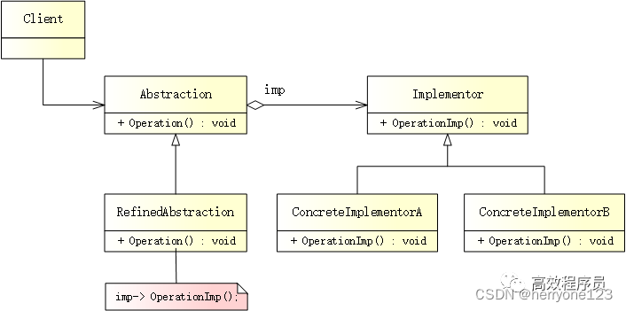


- Abstraction（抽象类）

  用于定义抽象类的接口，其中定义了一个Implementation（实现类接口）的对象并可以维护该对象，它与 Implementation具有关联关系。

- Refined Abstraction（扩充抽象类）

  扩充由Abstraction定义的接口，通常它不再是抽象类而是具体类。提供控制逻辑的变体。与其父类一样，它们通过通用实现接口与不同的实现进行交互

  提供高层控制逻辑，依赖于完成底层实际工作的实现对像

- Implementation（实现类接口）

  为所有具体实现声明通用接口。抽象部分仅能通过在这里声明的方法与实现对象交互

- ConcreateImplementations（具体实现类）

  包括特定的实现代码

- Client（客户端）

  仅关心如何与抽象部分合作。但是，Client需要将抽象对象与一个实现对象连接起来。

### 优缺点

#### 优点

- 分离抽象类及其实现部分。桥接模式使用“对象间的关联关系”解耦了抽象和实现之间 固有的绑定关系，使得抽象和实现可以沿着各自的维度来变化。
- 桥接模式是比多继承方案更好的解决方法。

- 桥接模式提高了系统的可扩展性，在两个变化维度中任意扩展一个维度，都不需要修改原有的系统。

- 实现细节对客户透明，可以对用户隐藏实现细节。用户在使用时不需要关系实现，在抽象层通过聚合关联关系完成封装与对象组合。

#### 缺点

- 桥接模式的引入会增加系统的理解与设计难度。聚合关系建立在抽象层，要求开发者针对抽象进行设计与编程。
- 桥接模式要求正确识别出系统的两个独立变化的维度，因此使用范围具有一定的局限性。

### 应用场景

当一个类内部具备两种或多种变化维度时，使用桥接模式可以解耦这些变化的维度，使高层代码架构稳定。
桥接模式通常适用于以下场景。

- 当一个类存在两个独立变化的维度，且这两个维度都需要进行扩展时。
- 当一个系统不希望使用继承或因为多层次继承导致系统类的个数急剧增加时。
- 当一个系统需要在构件的抽象化角色和具体化角色之间增加更多的灵活性时


## 组合模式

### 概念
组合模式，将对象组合成属性结构以表示‘部分-整体’的层次结构。组合模式使得用户对单个对象和组合对象的使用具有一致性。

### UML
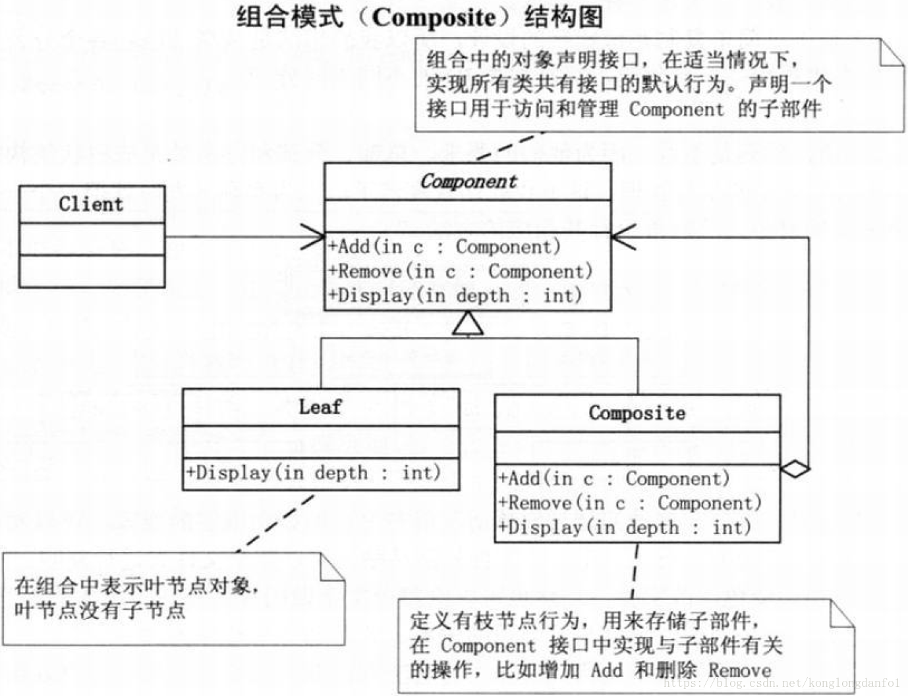

### code
```h
/* component_v1.h */
#pragma once

#include<iostream>
#include<string>
#include<vector>
#include<algorithm>
#include<memory>
using namespace std;
class componentPtr{
protected:
    string m_strName;

public:
    componentPtr(string str) : m_strName(str){}
    virtual void add(componentPtr *) = 0;
    virtual void remove(componentPtr *) = 0;
    virtual void display() = 0;
};

class leafPtr : public componentPtr {
public:
    leafPtr(string str) : componentPtr(str){}
    void add(componentPtr * p ){
        cout<<"leaf cannot add"<<endl;
    }
    void remove(componentPtr * p) {
        cout<<"leaf cannot remove"<<endl;
    }
    void display(){
        cout<<m_strName<<endl;
    }
};


class compositePtr : public componentPtr{
private:
    vector<shared_ptr<componentPtr>> m_vec;
public:
    compositePtr(string str) : componentPtr(str){}
    ~compositePtr(){
        if(!m_vec.empty()){
            m_vec.clear();
        }
    }
    void add(componentPtr *p){
        auto it = find_if(m_vec.begin(), m_vec.end(),
                [p](shared_ptr<componentPtr>ptr){return p == ptr.get();});
        if(it == m_vec.end()){
            m_vec.push_back(shared_ptr<componentPtr>(p));
        }
    }
    void remove(componentPtr *p){
        auto it = find_if(m_vec.begin(), m_vec.end(),
                          [p](shared_ptr<componentPtr>ptr){return p == ptr.get();});
        if( it == m_vec.end())
            return ;
        m_vec.erase(it);

    }

    void display(){
        for(auto it = m_vec.cbegin(); it != m_vec.cend(); it ++ ){
            (*it)->display();
        }
    }
};
```
```c++
/* component_v1.cpp */
#include "./inc/component_v1.h"

#if 0
int main(){
    /* component pattern */
    compositePtr * p1 = new compositePtr("main");
    leafPtr * p11 = new leafPtr("main boss");
    leafPtr * p12 = new leafPtr("main employee");
    p1->add(p11);
    p1->add(p12);
    compositePtr * p2 = new compositePtr("not main");
    leafPtr * p21 = new leafPtr("not main boss");
    leafPtr * p22 = new leafPtr("not main employee");
    p2->add(p21);
    p2->add(p22);
    p1->add(p2);
    p2->remove(p21);
    p1->display();
    return 0;

}
#endif

/*
mian boss
main employee
not main employee
*/
```


# 1.2.3 行为型设计模式

## 策略模式

### 概念

策略模式（Strategy Pattern）,定义一系列算法，将每一个算法封装起来，并让它们可以相互替换，策略模式是一种对象 行为型模式。

符合依赖倒置原则：

1. 高层次的模块不应该依赖于低层次的模块，他们都应该依赖于抽象。

2. 抽象不应该依赖于具体，具体应该依赖于抽象。

### 结构

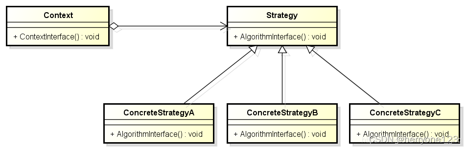

-  Context  环境类

  环境类是使用算法的角色，它在解决某个问题时可以采用多种策略

- Strategy 抽象策略类

  抽象策略类为所支持的算法声明了抽象方法，是所有策略类的父类，可以是抽象类，也可以是接口。

- ConcreteStrategy 具体策略类

  具体策略类实现了在抽象类中定义的算法，在运行时，具体策略类将覆盖在环境类中定义的抽象策略类，使用一种具体的算法实现某个业务处理。

### 优缺点

#### 优点

- 符合“开闭原则”，用户可以在**不修改原有系统的基础上选择算法和行为，也可以灵活的增加新的算法和行为。**
- 策略模式提供了管理相关算法族的办法。可以把公共的代码移植到父类中，从而避免重复的代码。
- 符合“单一职责原则”；
- 避免多重条件转换语句。

#### 缺点

- 客户端必须知道所有的策略类，并自行决定使用哪个策略类；
- 策略模式将产生很多策略类和对象，可以**通过使用享元模式减少对象的数量**。

### 与简单工厂模式的区别

1. 简单工厂模式是创建型模式， 简单工厂模式的实质是由一个工厂类根据传入的参数，动态决定应该创建并且返回哪一个产品类（这些产品类继承自一个父类或接口）的实例。在创建对象上的灵活性高，但是工厂类只能创建可能会使用到的产品类，假如新添了产品类就得修改工厂类，这样就会违反开闭原则。
2. 策略模式是行为型模式，它定义了一系列的算法，并将每一个算法封装起来，而且使它们还可以相互替换。策略模式让算法独立于使用它的客户而独立变化。

3. 在运行时，两者都是通过传入参数进行配置，简单工厂模式则是选择创建出需要的对象，而策略模式则是配置出需要的行为算法。一个是对象创建，另一个是行为算法的替换。

### 代码

```c++
#include<iostream>
using namespace std;

//抽象策略类
class Strategy{
public:
    virtual void Algo() = 0;
};

//具体策略类
class StrategyA:public  Strategy{
public:
    void Algo(){
        cout<<"this is StrategyA"<<endl;
    }
};

class StrategyB:public  Strategy{
public:
    void Algo(){
        cout<<"this is StrategyB"<<endl;
    }
};

class StrategyC:public  Strategy{
public:
    void Algo(){
        cout<<"this is StrategyC"<<endl;
    }
};

class StrategyD:public  Strategy{
public:
    void Algo(){
        cout<<"this is StrategyD"<<endl;
    }
};

//环境类
class Context{
public:
    Context(Strategy *strategy):pStrategy(strategy){}  // 初始化是传入具体的策略对象
    void ContextInterface(){
        pStrategy->Algo();  // 根据具体的策略对象，调用算法方法
    }
private:
    Strategy *pStrategy;
};

int main(){
    Strategy *pstratehyA = new StrategyA();
    Strategy *pstratehyB = new StrategyB();

    Context *pcontextA = new Context(pstratehyA);
    Context *pcontextB = new Context(pstratehyB);

    pcontextA->ContextInterface();
    pcontextB->ContextInterface();

    if(pstratehyA) delete pstratehyA;
    if(pstratehyB) delete pstratehyB;

    if(pcontextA)  delete pcontextA;
    if(pcontextB)  delete pcontextB;

    return 0;

}

//————————————————————————————————————————
// this is StrategyA
// this is StrategyB
```

### 策略与简单工厂结合

我们知道已有的AB两种算法，但是我们又不确定运行时使用哪种算法，同时为了让客户端和业务逻辑代码隔离开，于是，我们可以将客户端的创建算法类的业务逻辑转移到Cotent类，并添加一个创建算法工厂的方法。

```c++
#include<iostream>

#if 1
using namespace std;

typedef enum  StrategyTypeTag {
    strategyA,
    strategyB,
    strategyC,
}StrategyType;

class Strategy{
public:
    virtual void Algo() = 0;
};

//具体策略
class  StrategyA : public  Strategy{
public:
    void Algo(){
        cout<<"this is AlgoA"<<endl;
    }
};

class  StrategyB : public  Strategy{
public:
    void Algo(){
        cout<<"this is AlgoB"<<endl;
    }
};

class  StrategyC : public  Strategy{
public:
    void Algo(){
        cout<<"this is AlgoC"<<endl;
    }
};

class Context{
public:
    Context(Strategy *strategy):pstrategy(strategy){}
    void ContextInterface(){
        pstrategy->Algo();
    }

private:
    Strategy *pstrategy;
};


class Factory{
public:
    Strategy *CreateStrategy(StrategyType type){
        switch (type) {
            case strategyA:
                return new StrategyA();
            case strategyB:
                return new StrategyB();
            case strategyC:
                return new StrategyC();
            default:
                return NULL;

        }
    }
};

int main(){
    Factory *pfactory = new Factory();
    Strategy *pstrategy = pfactory->CreateStrategy(strategyA);

    Context *pcontext = new Context(pstrategy);

    pcontext->ContextInterface();
    if(pfactory)  delete pfactory;
    if(pstrategy)  delete pstrategy;
    if(pcontext)  delete pcontext;

    return 0;
}

#endif
```


## 模板方法模式
### 概念
定义一个操作中的算法的骨架，而将一些步骤延迟到子类中。模板方法使得子类可以不改变一个算法的结构即可重定义该算法的某些特定步骤。

### UML
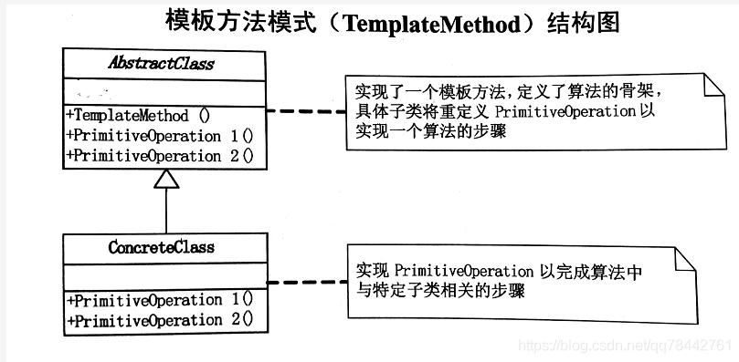
模板方法模式是通过把不变行为搬移到超类中，去除子类中的重复代码来提现他的优势。

模板方法模式提供了一个很好的代码复用。

当不变和可变的行为在方法的子类实现中混合在一起的时候，不变的行为就会在子类中重复出现。通过模板方法模式把这些行为搬移到单一的地方，这样就帮助子类摆脱重复不变行为的纠缠。

### code
```c++
/* template method */
#include <iostream>
using namespace std;
#if 1
class general{
public:
    void prepare_recipe(){
        boil_water();
        brew();
        pour_in_cup();
        add_condiments();
    }
private:
    virtual void brew(){
        cout<<"dripping sth through filter."<<endl;
    }
    virtual void add_condiments(){
        cout<<"adding something."<<endl;
    }
protected:
    void boil_water(){
        cout<<"boiling water"<<endl;
    }
    void pour_in_cup(){
        cout<<"pouring into cup"<<endl;
    }
};

class coffee : public general{
private:
    virtual void brew(){
        cout<<"dripping coffee through filter."<<endl;
    }
    virtual void add_condiments(){
        cout<<"adding sugar and milk"<<endl;
    }
};

class tea : public general{
private:
    virtual void brew(){
        cout<<"dripping tea through filter."<<endl;
    }
    virtual void add_condiments(){
        cout<<"adding lemon"<<endl;
    }
};

/* test */
int main(){
    general * b1 = new coffee;
    general * b2 = new tea;
    cout<<"coffee : "<<endl;
    b1->prepare_recipe();
    cout<<"tes : "<<endl;
    b2->prepare_recipe();

    return 0;
}
#endif
/*
coffee :
boiling water
dripping coffee through filter.
pouring into cup
adding sugar and milk
tes :
boiling water
dirpping tea through filter.
pouring into cup
adding lemon
*/
```
### 优点

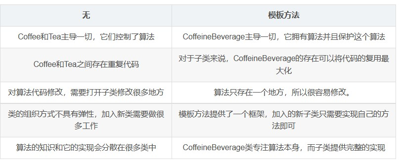


## 观察者模式

## 迭代子模式

## 责任链模式

## 命令模式

## 备忘录模式

## 状态模式

## 访问者模式

## 中介者模式

## 解释器模式
