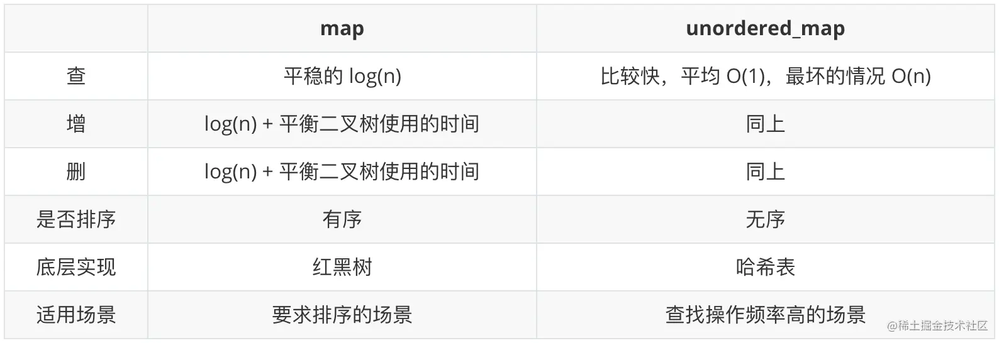

# 1.3.1 auto & decltype() 

## auto

### 语法
- auto  用模板实参推导的规则推导类型。
- decltype(auto)  类型是 decltype(expr)，其中 expr 是初始化器。

占位符 auto 可伴随如 const 或 & 这样的修饰符，它们参与类型推导。占位符 decltype(auto) 必须是被声明类型的唯一组分。 (C++14 起)

### 解释
占位类型说明符可以在下列语境出现：

- 变量的类型说明符中：`auto x = expr;`。从初始化器推导类型。
  如果占位类型说明符是 auto `或 类型约束 auto (C++20 起)`，那么采用从函数调用进行模板实参推导的规则，从初始化器推导变量的类型（细节见其他语境）。
  例如，给定 `const auto& i = expr;`，那么 i 的类型恰是某个虚构模板 `template\<class U> void f(const U& u)` 中参数 u 的类型（假如函数调用 `f(expr)` 通过编译）。因此，取决于初始化器，`auto&&` 可被推导成左值引用或右值引用类型，这被用于基于范围的 for 循环。
  `如果占位类型说明符是 decltype(auto) 或 类型约束 decltype(auto) (C++20 起)，那么推导出的类型是 decltype(expr)，其中 expr 是初始化器。`(C++14 起)

  **如果用占位类型说明符声明多个变量，那么推导出的类型必须互相匹配。例如，声明 `auto i = 0, d = 0.0;` 非良构，而声明 `auto i = 0, *p = &i;` 良构并将 auto 推导为 `int`。**

- new 表达式中的类型标识。从初始化器推导类型。对于 new T init（其中 T 含占位符类型，而 init 是带括号的初始化器或带花括号的初始化器列表），如同在虚设的声明 `T x init;` 中对变量 x 一般推导 T 的类型。

- (C++14 起) 函数或 lambda 表达式的返回类型中：`auto& f();`。从其未舍弃的 (C++17 起) return 语句的操作数推导返回类型。
  见返回类型推导。

- (C++17 起) 非类型模板形参的形参声明中：`template\<auto I> struct A;`。从对应的实参推导它的类型。

## decltype()
### 语法
- decltype(实体)
- decltype(表达式)

### 解释
1) 如果实参是没有括号的标识表达式或没有括号的类成员访问表达式，那么 decltype 产生以该表达式命名的实体的类型。如果没有这种实体或该实参指名了一组重载函数，那么程序非良构。
​	如果实参是指名某个结构化绑定的没有括号的标识表达式，那么 decltype 产生其被引用类型（在关于结构化绑定声明的说明中有所描述）。(C++17 起)

​	如果实参是指名某个非类型模板形参的没有括号的标识表达式，那么 decltype 生成该模板形参的类型（当该模板形参以占位符类型声明时，类型会先进行任何所需的类型推导）。(C++20 起)

2) 如果实参是其他类型为 T 的任何表达式，且
​	a) 如果 表达式 的值类别是亡值，将会 decltype 产生 T&&；
​	b) 如果 表达式 的值类别是左值，将会 decltype 产生 T&；
​	c) 如果 表达式 的值类别是纯右值，将会 decltype 产生 T。
​	如果 表达式 是返回类类型纯右值的函数调用，或是右操作数为这种函数调用的逗号表达式，那么不会对该纯右值引入临时量。(C++17 前)

​	如果 表达式 是除了（可带括号的）立即调用以外的 (C++20 起)纯右值，那么不会从该纯右值实质化临时对象：即这种纯右值没有结果对象。(C++17 起)

​	该类型不需要是完整类型或拥有可用的析构函数，而且类型可以是抽象的。此规则不适用于其子表达式：decltype(f(g())) 中，g() 必须有完整类型，但 f() 不必。

**注意**如果对象的名字带有括号，那么它会被当做通常的左值表达式，从而 decltype(x) 和 decltype((x)) 通常是不同的类型。

在难以或不可能以标准写法进行声明的类型时，decltype 很有用，例如 lambda 相关类型或依赖于模板形参的类型。


# 1.3.2 STL容器 智能指针 正则表达式

## unordered_map

map 和 unordered_map 都可以看做是一种 `key-value` 的映射关系，unordered_map 可以理解为 **无序版的map**。unordered_map 是在 C++11 标准才出现的，所以你在代码中如果使用了 unordered_map，则在编译的时候要使用 **c++11及以后的标准** 进行编译。

   这里直击要点：

- **map 底层是 红黑树**，(1) 增、删、改、查都是十分平稳的 `log(n)` 的复杂度，(2) 基于二叉查找树，数据是有序排列的 (按 key 排序)。在存储上 map 比较占用空间，因为在红黑树中，每一个节点都要额外保存父节点和子节点的连接，因此使得每一个节点都占用较大空间来维护红黑树的性质。
- **unordered_map 底层是 hash表**， 其查找的复杂度是常数级别的 `O(1)`，构造的时候如果有冲突时间成本会增加，并且做不到数据有序排列。冲突的解决：当冲突数小于8的时候用链式地址法解决冲突，当冲突大于8的时候使用红黑树解决冲突。



### 插入元素
- 直接用[]
```c++
map<int, string> m;
m[0] = "a";
m[1] = "b";
```
- make_pair
- pair
```c++
m.insert(pair<int, string>(2, "c"));
```
- value_type
```c++
m.insert(map<int, string>::value_type(3, "d"));
```
*注：所有的insert方式，如果插入的key值在map中原来存在，都不能改变其原来对应的值*

## STL容器

## hash 的用法和原理

### 定义
Hash，一般翻译做散列、杂凑，或音译为哈希，是把任意长度的输入（又叫做预映射pre-image）通过散列算法变换成固定长度的输出，该输出就是散列值。这种转换是一种压缩映射，也就是，散列值的空间通常远小于输入的空间，不同的输入可能会散列成相同的输出，所以不可能从散列值来确定唯一的输入值。简单的说就是一种将任意长度的消息压缩到某一固定长度的消息摘要的函数。

### 简介
- Hash算法可以将一个数据转换为一个标志，这个标志和源数据的每一个字节都有十分紧密的关系。

- Hash算法还具有一个特点，就是很难找到逆向规律。基本不可能从结果推算出输入，所以又称为不可逆的算法
- Hash算法是一个广义的算法，也可以认为是一种思想，使用Hash算法可以提高存储空间的利用率，可以提高数据的查询效率，也可以做数字签名来保障数据传递的安全性。所以Hash算法被广泛地应用在互联网应用中。
- Hash算法也被称为散列算法，Hash算法虽然被称为算法，但实际上它更像是一种思想。Hash算法没有一个固定的公式，只要符合散列思想的算法都可以被称为是Hash算法

### 常见的哈希算法

- MD4
- MD5
- SHA-1及其他

### 哈希的用途

- 文件校验
- 数字签名
- 鉴权协议

### code
```c++
#include<iostream>
#include<functional>
#include<string>
using namespace std;

struct S {
    string first_name;
    string last_name;
};

template<class T> class MyHash;

template<>
class MyHash<S>{
public:
    size_t operator()(const S &s) const{
        size_t h1 = hash<string>()(s.first_name);
        size_t h2 = hash<string>()(s.last_name);
        return h1 ^ (h2 << 1);
    }
};

int main(){

    string s1 = "bububu";
    string s2 = "jbabkjwdb";
    hash<string> h1;

    S ss;
    ss.first_name = s1;
    ss.last_name = s2;

    cout<<"hash(s1) = "<< h1(s1)<< "\n"
        <<"hash(s2) = "<<hash<string>()(s2)<<"\n"
        <<"hash(ss) = "<<MyHash<S>()(ss)<<"\n";


    return 0;
}

/*
hash(s1) = 5113910809497226432
hash(s2) = 2022884468270540529
hash(ss) = 9141523982402158882
*/
```


## share_ptr, unique_ptr

## besic_regex, sub_match

## 函数对象模板 function，bind

# 1.3.2 新特性的线程，协程，原子操作，lamda表达式
## atomic 的用法与原理

## thread_local与cond_ition_variable

## 异常处理 exception_ptr

## 错误处理 error_category

## coroutine 的用法与原理
```

```