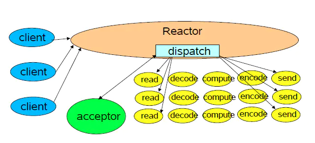

# 2.1.1 网络io与select, poll,epoll
## socket 与文件描述符的关联
### socket 函数
- 功能： 指定协议类型
- 定义： 
```c
	#include<sys/types.h>
	#include<sys/socket.h>
	int socket(int family, int type, int protocol);
	- return value
	- error: -1;
	- success: 套接字 sockfd;
	- 理解socket
		socket使用 Unix 文件描述符 (file descriptor) 和其他程序通讯的方式。Unix 程序在执行任何形式的 I/O 的时候，程序是在读或者写一个文件描述符。一个文件描述符只是一个和打开的文件相关联的整数。这个文件可能是一个网络连接，FIFO，管道，终端，磁盘上的文件或者什么其他的东西。Unix 中所有的东西是文件！因此，与 Internet 上别的程序通讯的时候，要通过文件描述符。利用系统调用 socket()得到网络通讯的文件描述符。他返回套接口描述符 (socket descriptor)，然后再通过他来调用 send() 和 recv()。
```

## sigio 的异步通知

- 在前面使用阻塞或者非阻塞的方式来读取驱动中按键值都是应用程序主动读取的，对于非阻塞方式来说还需要应用程序通过 poll 函数不断的轮询。最好的方式就是驱动程序能主动向应用程序发出通知，报告自己可以访问，然后应用程序在从驱动程序中读取或写入数据，类似于我们在裸机例程中讲解的中断。Linux 提供了异步通知这个机制来完成此功能
- 中断是处理器提供的一种异步机制，我们配置好中断以后就可以让处理器去处理其他的事情了，当中断发生以后会触发我们事先设置好的中断服务函数，在中断服务函数中做具体的处理。比如我们在裸机篇里面编写的 GPIO 按键中断实验，我们通过按键去开关蜂鸣器，采用中断以后处理器就不需要时刻的去查看按键有没有被按下，因为按键按下以后会自动触发中断。同样的，Linux 应用程序可以通过阻塞或者非阻塞这两种方式来访问驱动设备，通过阻塞方式访问的话应用程序会处于休眠态，等待驱动设备可以使用，非阻塞方式的话会通过 poll 函数来不断的轮询，查看驱动设备文件是否可以使用。这两种方式都需要应用程序主动的去查询设备的使用情况，如果能提供一种类似中断的机制，当驱动程序可以访问的时候主动告诉应用程序那就最好了。
  “信号”为此应运而生，信号类似于我们硬件上使用的“中断”，只不过信号是软件层次上的。算是在软件层次上对中断的一种模拟，驱动可以通过主动向应用程序发送信号的方式来报告自己可以访问了，应用程序获取到信号以后就可以从驱动设备中读取或者写入数据了。整个过程就相当于应用程序收到了驱动发送过来了的一个中断，然后应用程序去响应这个中断，在整个处理过程中应用程序并没有去查询驱动设备是否可以访问，一切都是由驱动设备自己告诉给应用程序的。
  阻塞、非阻塞、异步通知，这三种是针对不同的场合提出来的不同的解决方法，没有优劣之分，在实际的工作和学习中，根据自己的实际需求选择合适的处理方法即可。

### signal 函数
```c
	#include<signal.h>
	#include<sys/types.h>
	sighandler_t signal(int signum, sighandler_t handler)
	- args
	- sgnum: 要设置处理函数的信号；
	- handler: 信号的处理函数
	- return value: 
		- error: SIG_ERR
		- success: 返回信号的前一个处理函数
```
### 应用程序对异步通知的处理
- 注册信号处理函数
  应用程序根据驱动程序所使用的信号设置信号的处理函数，应用程序使用signal 函数来设置信号的处理函数。
- 将本应用程序的进程号告诉内核
  使用fcntl(fd, F_SETOWN, getpid()) 将本应用程序的进程号告诉内核
- 开启异步通知
  使用如下两行程序开启异步通知
```c
flags = fcntl(fd, F_GETFL);  // 获取当前的进程状态
fcntl(fd, F_SETFL, flags | FASYNC);  // 开启当前进程异步通知功能
```

## 多路复用select/poll

- select，poll，epoll都是IO多路复用的机制。所谓I/O多路复用机制，就是说通过一种机制，可以监视多个描述符，一旦某个描述符就绪（一般是读就绪或者写就绪），能够通知程序进行相应的读写操作。但select，poll，epoll本质上都是同步I/O，因为他们都需要在读写事件就绪后自己负责进行读写，也就是说这个读写过程是阻塞的，而异步I/O则无需自己负责进行读写，异步I/O的实现会负责把数据从内核拷贝到用户空间。
- select和poll的实现比较相似，目前也有很多为人诟病的缺点，epoll可以说是select和poll的增强版。

### 一、select实现

1. 使用copy_from_user从用户空间拷贝fd_set到内核空间
2. 注册回调函数__pollwait
3. 遍历所有fd，调用其对应的poll方法（对于socket，这个poll方法是sock_poll，sock_poll根据情况会调用到tcp_poll,udp_poll或者datagram_poll）
4. 以tcp_poll为例，其核心实现就是__pollwait，也就是上面注册的回调函数。
5. __pollwait的主要工作就是把current（当前进程）挂到设备的等待队列中，不同的设备有不同的等待队列，对于tcp_poll来说，其等待队列是sk->sk_sleep（注意把进程挂到等待队列中并不代表进程已经睡眠了）。在设备收到一条消息（网络设备）或填写完文件数据（磁盘设备）后，会唤醒设备等待队列上睡眠的进程，这时current便被唤醒了。
6. poll方法返回时会返回一个描述读写操作是否就绪的mask掩码，根据这个mask掩码给fd_set赋值。
7. 如果遍历完所有的fd，还没有返回一个可读写的mask掩码，则会调用schedule_timeout是调用select的进程（也就是current）进入睡眠。当设备驱动发生自身资源可读写后，会唤醒其等待队列上睡眠的进程。如果超过一定的超时时间（schedule_timeout指定），还是没人唤醒，则调用select的进程会重新被唤醒获得CPU，进而重新遍历fd，判断有没有就绪的fd。
8. 把fd_set从内核空间拷贝到用户空间。

**总结：**
select的几大缺点：

1. 每次调用select，都需要把fd集合从用户态拷贝到内核态，这个开销在fd很多时会很大
2. 同时每次调用select都需要在内核遍历传递进来的所有fd，这个开销在fd很多时也很大
3. select支持的文件描述符数量太小了，默认是1024

### 二、poll实现

poll的实现和select非常相似，只是描述fd集合的方式不同，poll使用pollfd结构而不是select的fd_set结构。其他的都差不多。

### 三、epoll实现

epoll既然是对select和poll的改进，就应该能避免上述的三个缺点。那epoll都是怎么解决的呢？在此之前，我们先看一下epoll和select和poll的调用接口上的不同，select和poll都只提供了一个函数——select或者poll函数。而epoll提供了三个函数，epoll_create,epoll_ctl和epoll_wait，epoll_create是创建一个epoll句柄；epoll_ctl是注册要监听的事件类型；epoll_wait则是等待事件的产生。
对于**第一个缺点**，epoll的解决方案在epoll_ctl函数中。每次注册新的事件到epoll句柄中时（在epoll_ctl中指定EPOLL_CTL_ADD），会把所有的fd拷贝进内核，而不是在epoll_wait的时候重复拷贝。epoll保证了每个fd在整个过程中只会拷贝一次。
对于**第二个缺点**，epoll的解决方案不像select或poll一样每次都把current轮流加入fd对应的设备等待队列中，而只在epoll_ctl时把current挂一遍（这一遍必不可少）并为每个fd指定一个回调函数，当设备就绪，唤醒等待队列上的等待者时，就会调用这个回调函数，而这个回调函数会把就绪的fd加入一个就绪链表）。epoll_wait的工作实际上就是在这个就绪链

可以看到，总体和select的实现是类似的，只不过它是创建了一个eppoll_entry结构pwq，只不过pwq->wait的func成员被设置成了回调函数ep_poll_callback（而不是default_wake_function，所以这里并不会有唤醒操作，而只是执行回调函数），private成员被设置成了NULL。最后吧pwq->wait链入到whead中（也就是设备等待队列中）。这样，当设备等待队列中的进程被唤醒时，就会调用ep_poll_callback了。

再梳理一下，当epoll_wait时，它会判断就绪链表中有没有就绪的fd，如果没有，则把current进程加入一个等待队列(file->private_data->wq)中，并在一个while（1）循环中判断就绪队列是否为空，并结合schedule_timeout实现睡一会，判断一会的效果。如果current进程在睡眠中，设备就绪了，就会调用回调函数。在回调函数中，会把就绪的fd放入就绪链表，并唤醒等待队列(file->private_data->wq)中的current进程，这样epoll_wait又能继续执行下去了。
对于第三个缺点，epoll没有这个限制，它所支持的FD上限是最大可以打开文件的数目，这个数字一般远大于2048,举个例子,在1GB内存的机器上大约是10万左右，具体数目可以cat /proc/sys/fs/file-max察看,一般来说这个数目和系统内存关系很大。
**总结：**

1. select，poll实现需要自己不断轮询所有fd集合，直到设备就绪，期间可能要睡眠和唤醒多次交替。而epoll其实也需要调用epoll_wait不断轮询就绪链表，期间也可能多次睡眠和唤醒交替，但是它是设备就绪时，调用回调函数，把就绪fd放入就绪链表中，并唤醒在epoll_wait中进入睡眠的进程。虽然都要睡眠和交替，但是select和poll在“醒着”的时候要遍历整个fd集合，而epoll在“醒着”的时候只要判断一下就绪链表是否为空就行了，这节省了大量的CPU时间。这就是回调机制带来的性能提升。
2. select，poll每次调用都要把fd集合从用户态往内核态拷贝一次，并且要把current往设备等待队列中挂一次，而epoll只要一次拷贝，而且把current往等待队列上挂也只挂一次（在epoll_wait的开始，注意这里的等待队列并不是设备等待队列，只是一个epoll内部定义的等待队列）。这也能节省不少的开销。


| selec | poll        | epoll      |                                     |
| ----- | ----------- | ---------- | ----------------------------------- |
| 数据结构  | bitmap      | 数组         | 红黑树                                 |
| 最大连接数 | 1024        | 无上限        | 无上限                                 |
| fd拷贝  | 每次调用selec拷贝 | 每次调用poll拷贝 | fd首次调用epoll_ctl拷贝，每次调用epoll_wait不拷贝 |
| 工作效率  | 轮询O：(n）     | 轮询：O(n）    | 回调：O(1）                             |

## 手撕epoll 单线程，多线程，多进程的多种写法


## 代码实现 LT/ET 的区别

# 2.1.2 reactor 的原理与实现

## 原理

在处理web请求时，通常有两种体系结构，分别为：**thread-based architecture（基于线程）**、**event-driven architecture（事件驱动）**

**thread-based architecture**

基于线程的体系结构通常会使用多线程来处理客户端的请求，每当接收到一个请求，便开启一个独立的线程来处理。这种方式虽然是直观的，但是仅适用于并发访问量不大的场景，因为线程需要占用一定的内存资源，且操作系统在线程之间的切换也需要一定的开销，当线程数过多时显然会降低web服务器的性能。并且，当线程在处理I/O操作，在等待输入的这段时间线程处于空闲的状态，同样也会造成cpu资源的浪费。一个典型的设计如下：

**event-driven architecture**

事件驱动体系结构是目前比较广泛使用的一种。这种方式会定义一系列的事件处理器来响应事件的发生，并且将服务端接受连接与对事件的处理分离。其中，事件是一种状态的改变。比如，tcp中socket的new incoming connection、ready for read、ready for write。
### reactor

reactor主要由以下几个角色构成：handle、Synchronous Event Demultiplexer、Initiation Dispatcher、Event Handler、Concrete Event Handler
**handle**
handle在linux中一般称为文件描述符，而在window称为句柄，两者的含义一样。handle是事件的发源地。比如一个网络socket、磁盘文件等。而发生在handle上的事件可以有connection、ready for read、ready for write等。
**Synchronous Event Demultiplexer**
同步事件分离器，本质上是系统调用。比如linux中的select、poll、epoll等。比如，select方法会一直阻塞直到handle上有事件发生时才会返回。
**Event Handler**
事件处理器，其会定义一些回调方法或者称为钩子函数，当handle上有事件发生时，回调方法便会执行，一种事件处理机制。
**Concrete Event Handler**
具体的事件处理器，实现了Event Handler。在回调方法中会实现具体的业务逻辑。
**Initiation Dispatcher**
初始分发器，也是reactor角色，提供了注册、删除与转发event handler的方法。当Synchronous Event Demultiplexer检测到handle上有事件发生时，便会通知initiation dispatcher调用特定的event handler的回调方法。
#### 处理流程
1. 当应用向Initiation Dispatcher注册Concrete Event Handler时，应用会标识出该事件处理器希望Initiation Dispatcher在某种类型的事件发生发生时向其通知，事件与handle关联

2. Initiation Dispatcher要求注册在其上面的Concrete Event Handler传递内部关联的handle，该handle会向操作系统标识

3. 当所有的Concrete Event Handler都注册到 Initiation Dispatcher上后，应用会调用handle_events方法来启动Initiation Dispatcher的事件循环，这时Initiation Dispatcher会将每个Concrete Event Handler关联的handle合并，并使用Synchronous Event Demultiplexer来等待这些handle上事件的发生

4. 当与某个事件源对应的handle变为ready时，Synchronous Event Demultiplexer便会通知 Initiation Dispatcher。比如tcp的socket变为ready for reading

5. Initiation Dispatcher会触发事件处理器的回调方法。当事件发生时， Initiation Dispatcher会将被一个“key”（表示一个激活的handle）定位和分发给特定的Event Handler的回调方法

6. Initiation Dispatcher调用特定的Concrete Event Handler的回调方法来响应其关联的handle上发生的事件


## reactor 针对业务实现的优点

1. 响应快，不必为单个同步事件所阻塞，虽然Reactor本身依然是同步的
2. 可以最大程度的避免复杂的多线程及同步问题，并且避免了多线程/进程的切换开销

3. 扩展性好，可以方便的通过增加Reactor实例个数来充分利用CPU资源

4. 复用性好，Reactor模型本身与具体事件处理逻辑无关，具有很高的复用性
   ​

## epoll 封装send_cb/recv_cb/accept_cb
## reactor 多核实现
## 跨平台(select/epoll/kqueue)的封装reactor