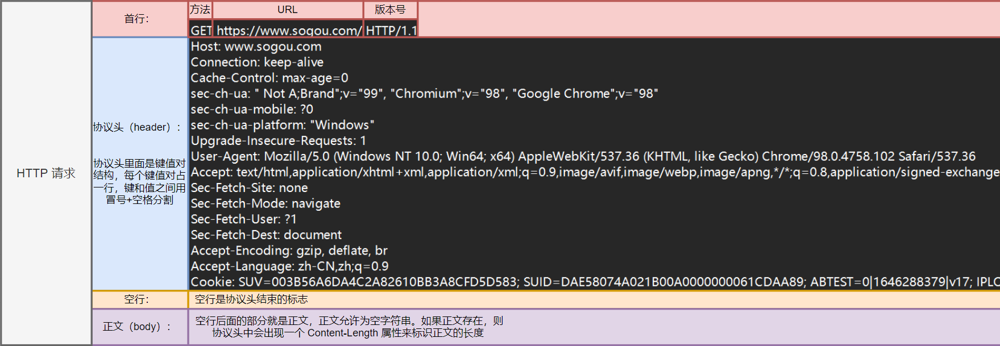
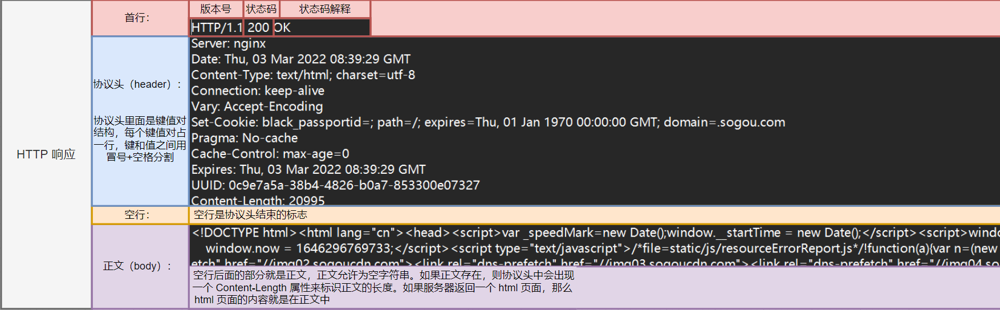
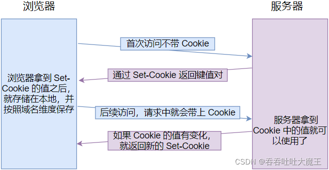
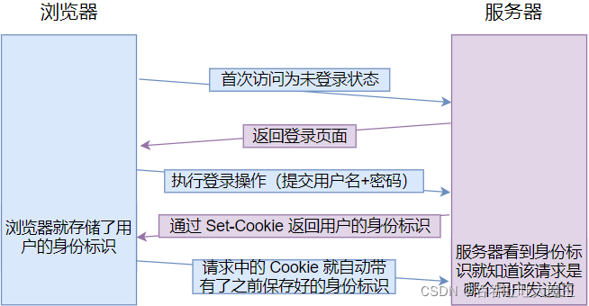

# 简介
- **超文本传输协议**（Hyper Text Transfer Protocol，HTTP）是一个简单的请求-响应协议，它通常运行在**TCP**之上。它指定了客户端可能发送给服务器什么样的消息以及得到什么样的响应。请求和响应消息的头以ASCII形式给出；而消息内容则具有一个类似MIME的格式。
- HTTP是**应用层协议**，同其他应用层协议一样，是为了实现某一类具体应用的协议，并由某一运行在用户空间的应用程序来实现其功能。HTTP是一种协议规范，这种规范记录在文档上，为真正通过HTTP进行通信的HTTP的实现程序。
- HTTP是基于**B/S架构**进行通信的，而HTTP的服务器端实现程序有httpd、nginx等，其客户端的实现程序主要是Web浏览器，例如Firefox、Internet Explorer、Google Chrome、Safari、Opera等，此外，客户端的命令行工具还有elink、curl等。Web服务是基于TCP的，因此为了能够随时响应客户端的请求，Web服务器需要监听在80/TCP端口。这样客户端浏览器和Web服务器之间就可以通过HTTP进行通信了。

# 工作原理
- HTTP是基于客户/服务器模式，且面向连接的。典型的HTTP事务处理有如下的过程：

1. 客户与服务器建立连接；
2. 客户向服务器提出请求；
3. 服务器接受请求，并根据请求返回相应的文件作为应答；
4. 客户与服务器关闭连接。

- 重要特点：一发一收，一问一答


- 客户与服务器之间的HTTP连接是一种**一次性连接**，它限制每次连接只处理一个请求，当服务器返回本次请求的应答后便立即关闭连接，下次请求再重新建立连接。这种一次性连接主要考虑到WWW服务器面向的是Internet中成千上万个用户，且只能提供有限个连接，故服务器不会让一个连接处于等待状态，及时地释放连接可以大大提高服务器的执行效率。 
- HTTP是一种**无状态协议**，即服务器不保留与客户交易时的任何状态。这就大大减轻了服务器记忆负担，从而保持较快的响应速度。HTTP是一种面向对象的协议。允许传送任意类型的数据对象。它通过数据类型和长度来标识所传送的数据内容和大小，并允许对数据进行压缩传送。当用户在一个HTML文档中定义了一个超文本链后，浏览器将通过TCP/IP协议与指定的服务器建立连接。
- HTTP**支持持久连接**，在HTTP / 0.9和1.0中，连接在单个请求/响应对之后关闭。在HTTP / 1.1中，引入了保持活动机制，其中连接可以重用于多个请求。这样的持久性连接可以明显减少请求延迟，因为在发送第一个请求之后，客户端不需要重新协商TCP 3-Way-Handshake连接。另一个积极的副作用是，通常，由于TCP的缓慢启动机制，连接随着时间的推移而变得更快。
- 该协议的1.1版还对HTTP / 1.0进行了带宽优化改进。例如，HTTP / 1.1引入了分块传输编码，以允许流传输而不是缓冲持久连接上的内容。HTTP流水线进一步减少了延迟时间，允许客户端在等待每个响应之前发送多个请求。协议的另一项附加功能是字节服务，即服务器仅传输客户端明确请求的资源部分。
- 从技术上讲是客户在一个特定的TCP端口（端口号一般为80）上打开一个套接字。如果服务器一直在这个周知的端口上倾听连接，则该连接便会建立起来。然后客户通过该连接发送一个包含请求方法的请求块。
- HTTP规范定义了9种请求方法，每种请求方法规定了客户和服务器之间不同的信息交换方式，常用的请求方法是GET和POST。服务器将根据客户请求完成相应操作，并以应答块形式返回给客户，最后关闭连接。 

# 协议格式
- 请求格式
  
- 响应格式
  
- **注意：** 为什么HTTP报文中要存在空行吗？

> - 因为HTTP 协议并没有规定报头部分的键值对有多少个，使用空行就相当于是报文的结束标记和正文之间的分隔符
> - HTTP 在传输层依赖TCP 协议，TCP 是面向字节流的。如果没有这个空行，就会出现“粘包问题”

## “粘包问题”

### 什么是粘包问题

- 粘包是指的是数据和数据之间没有没有明确的分界线，导致不能够正确的传输数据（只有TCP会粘包 UDP 永远不会粘包），粘包问题只针对于一切字节流的协议
- TCP也可以称为流式协议，UDP称为数据报式协议
- 对于流式协议：发送端可以1K1K的发送数据，接收端可以2k2k的提取数据，也可以3K4K的提取数据，所以对于接收端应用程序中看到的数据就是一个整体，“数据流”，一条消息里面有多少字节应用程序是看不见的，所以TCP协议面向字节流，就会出现粘包问题，而UDP这种面向消息的协议，每个UDP段都是一条消息，接收方必须以消息为单位进行提取数据，不能一次提取任意字节的数据
- 所谓的粘包问题就是接收方不知道消息和消息之间的边界，不知道一次提取多少个字节导致的

### 具体原因

应用程序无法直接操作硬件，应用程序想要操作数据必须要将数据交给操作系统，OS会为应用提供数据传输的服务，所以OS不会立刻把数据发出去，会为应用程序提供一个缓冲区，存在临时的数据

**发送方：**

> 当应用程序调用send函数时候，应用程序会将数据从应用程序拷贝到操作系统缓存里面，再由OS从缓冲区里面读数据，把数据发出去

**接收方：**

>  对方计算机收到的数据也是OS先收到的，至于应用程序如何处理这些数据，OS不知道，所以同样需要将数据先存储到OS 的缓冲区里面，当应用程序调用recv的时候，实际上是将OS缓冲区里面的数据拷贝到应用程序的过程

### 解决

服务端如果想要保证每次都能接收到客户端发来的不定长度的数据包，程序员应该如何来解决这个问题呢？

1. 使用应用层协议（http,https）来封装要传输的不定长的数据包

2. 再每个数据的后面添加一些特殊字符，如果遇到特殊字符，说明这条数据接收完毕了

   每接收一个字符就要对这些字符进行判定，判定是不是特殊的字符串，**效率很低**

3. 在发送数据快之前，在数据块之前添加一个固定大小的包头：数据头+数据块

   数据头：存储当前数据包的总字节数，接收端先接收数据头，然后再根据数据头接收对应的大小

   数据块：当前数据包的内容

### 解决方案

如果使用TCP进行套接字通信，如果发送的数据包连在了一块，导致接收端无法解析，我们通常使用**添加包头**的方式来轻松解决这个问题，包头的大小为**4个字节**(一个int类型)，**存储当前数据块的总字节数**

> 完整的数据块：包头（int 四字节） - 数据包内容（char* 总字节数被记录到包头里边）

**发送端**

1. 根据发送的数据长度N****动态申请一个固定大小的内存：N+4（4是包头占用的字节数）
2. 将待发送的数据的总长度写入申请的内存的前4个字节(memcpy前4个字节)，此处应该先将其转化为网络字节序（大端），再写入
3. 将待发送的数据拷贝到包头后面的地址空间中，将完整的数据包发送出去（字符串没有字节序问题）
4. 用一个函数来进行发送,把所有的字节全部发送出去
5. 释放申请的堆内存空间

```c

//发送指定长度的字符串
int writen(int fd,const char* msg,int size)//发送，避免粘包，丢包
{
    const char * buf=msg;//buf指向的是msg的首地址
    int count=size;//剩余的长度没有被发送出去的字节数
    while(count>0)
    {
        //不停的进行数据发送
        int len=send(fd,buf,count,0);//send成功返回发送出去的字节数，否则失败返回-1，fd为向哪一个文件描述符里面发送
        //buf是发送的数据
        //count是数据的长度
        if(len==-1)
        {
            //发送失败
            return -1;
        }
        else if(len==0)
        {
            //一个字节都没有发送出去
            continue;//再发送一次
        }
        else
        {
            buf+=len;//buf这个指针往后移动，后面buf就全部发送了出去
            count-=len;//count为剩余的字节数，变成0的话就发送完成了
        }
    }
    return size;//发送成功

}


//这个加包头的操作就是这样了，其他客户端该怎么发还是怎么发送
//发送数据
//len为数据的大小 
//msg为发送的数据 
int sendmsg(int cfd,const char* msg,int len)
{
    if(cfd<0||msg==nullptr||len<=0)
    {
        exit(1);
    }
    char * data=(char*)malloc(sizeof(len+4));//先动态申请一些内存，+4是为了存数据头
    int biglen=htonl(len);//把要发送的数据的长度先转化成网络字节序
    memcpy(data,&biglen,4);//把biglen的浅4个字节拷贝到data里面
    //把我们需要的数据也拷贝到这一个内存里面去
    memcpy(data+4,msg,len);
    //数据拷贝完之后就要发送数据了
    int ret=writen(cfd,data,len+4);//+4是因为要加上这个数据的包头,把data传过去发送，连通它的头
    if(ret==-1)
    {
        close(cfd);//函数调用失败,把文件描述符关掉
    }
    //发送完之后再把内存给释放掉
    free(data);
}
```

**接收端**

1. 首先**先接收4个字节**（包头，记录了**接收的数据的长度**），并将它从网络字节序转化为主机字节序，这样就可以获得这些数据的总长度了
2. 根据得到的数据块长度**申请固定大小的堆内存**，用于**存储待接收**的信息
3. 处理接收的数据
4. 释放存储数据的堆内存

```c
//接收端
//接收指定字节个数

int readn(int fd,char* buf,int size)//buf里面就是我们要把数据读取到的地方
{
    //我们需要往buf这个内存地址里面写数据了，所以不能加const
    //我们需要记录还需要读取多少个字节，以及读取到的位置
    char* pt=buf;
    int count=size;//我们剩余要接收的字节数
    while(count>0)
    {
        int len=recv(fd,pt,count,0);//pt我们需要读取的地址，count就是我们需要读取的字节数，len就是实际读取到的长度
        if(len==-1)
        {
            //读取失败
            return -1;
        }
        else if(len==0)
        {
            //发送端已经断开了连接
            return size-count;//我们就返回收到的字节数
        }
        else
        {
            //正常的读取了
            pt+=len;
            count-=len;
        }
    }
    return size;//成功返回
}


//接收函数
int recvmsg(int fd,char** msg)//这里的msg是一个输出型参数
{
    //我们需要先把数据头给读出来，看它的数据是有多少的数据
    int len=0;
    readn(fd,(char*)&len,4);//我们把数据读取到len里面
    //现在还是网络字节序，我们需要将它转化为主机字节序
    len=ntohl(len);
    cout<<"要接收到的数据块的长度为"<<len<<endl;
    //根据我们读取到的长度len（有效数据的大小）来分配长度
    char* data=(char*)malloc(sizeof(len+1));//+1是‘\0’,字符串结束的标志
    //再去调用这个函数
    int length=readn(fd,data,len);//我们要接收的数据长度是len
    if(length==len)
    {
        cout<<"读取成功"<<endl;

    }
    else
    {
        //接收数据失败了
        cout<<"接收数据失败了"<<endl;
        close(fd);
        free(data);//因为接收失败了，所以这块内存就没有意义了
        return -1;
    }
    data[len]='\0';
    *msg=data;
	return length;
}
```

# 请求(request)

## 方法

### GET

#### 基本介绍

GET 是最常用的 HTTP 方法，常用于获取服务器上的某个资源。以下几种方式都会触发 GET 方法的请求
- 在浏览器中直接输入 URL 回车或点击浏览器收藏夹中的链接，此时浏览器就会发送出一个 GET 请求。
- HTML 中的 link、img、script 等标签的属性中放的 URL，浏览器也会构造出 HTTP GET 请求
- 使用 Javascript 重点 ajax，也能构造出 HTTP GET 请求
- 各种编程语言（只要能够访问网络），就都能够构造出 HTTP GER 请求

#### GET 请求的特点：

- 首行里面的第一个部分就是 GET
- URL 里面的 query string 可以为空，也可以不为空
- GET 请求的 header 有若干个键值对结构
- GET 请求的 body 一般是空的

### POST

#### 基本介绍：

POST 方法也是一种常见的方法，多用于提交用户输入的数据给服务器（如登录页面）。以下几种方法都会触发 POST 方法的请求

- 通过 HTML 中的 form 标签可以构造 POST 请求
- 使用 JavaScript 的 ajax 可以构造 POST 请求

#### POST 请求的特点：

- 首行第一个部分就是 POST
- URL 里面的 query string 一般是空的
- POST 请求的 header 里面有若干个键值对
- POST 请求的 body 一般不为空（body 的具体数据格式，由 header 中的 Content-Type 来描述；body 的具体数据长度，由 header 中的 Content-Length 来描述

### GET 与 POST 的区别

GET 和 POST 其实没有本质区别，使用 GET 的场景完全可以使用 POST 代替，使用 POST 的场景一样可以使用 GET 代替。但是在具体的使用上，还是存在一些细节的区别

- GET 习惯上会把客户端的数据通过 query string 来传输（body 部分是空的）；POST 习惯上会把客户端的数据通过 body 来传输（query string 部分是空的）
- GET 习惯上用于从服务器获取数据；POST 习惯上是客户端给服务器提交数据
- 一般情况，程序员会把 GET 请求的处理，实现成“幂等”的；对于 POST 请求的处理，不要求实现成**“幂等”**
- GET 请求可以被缓存，可以被浏览器保存到收藏夹中；POST 请求不能被缓存

#### 补充：幂等是什么

- 一个 HTTP 方法是幂等的，指的是同样的请求被执行一次与连续执行多次的效果是一样的，服务器的状态也是一样的。换句话说，**幂等的方法不应该具有副作用。**

> 比如我们去抢购一件物品，如果我们已经抢到了要进行下单，由于很多人都在抢购，所以下单后，我们发现好像没有什么反应，因此我们又不断的点击
>
> 下单。如果最终我们只需要付一件产品的钱，就是幂等的，如果要支付N件产品的钱，就不是幂等的

- 在正确的条件下，GET、HEAD、PUT 和 DELETE 等方法是幂等的；POST 方法不是幂等的
- 幂等性只与后端服务器的实际状态有关，而每一次请求接收到的状态码不一定相同


### 关于 GET 请求的 URL 长度问题的误解

- **网上有一种错误的解释**： GET 请求的长度是存在上限的，这个上限有被说成 1024kb、2048kb 等等，并且 GET 请求存在上限的原因是 URL 的长度存在上限
- **RFC 2616 标准正确的解释**： HTTP 协议由 RFC 2616 标准定义，该标准中明确说明 "Hypertext Transfer Protocol -- HTTP/1.1," does not specify any requirement for URL length，即没有对 URL 的长度有任何限制
- **URL 的长度取决因素**： 实际上 URL 的长度取决于浏览器的实现和 HTTP 服务器端的实现。在浏览器端，不同的浏览器最大的长度是不同的，但是现在浏览器支持的长度一般都很长；在服务器端，一般这个长度是可以配置的

### 关于 POST 比 GET 更安全的误解

- **网上有一种错误的解释**： 如果实现登录页面，如果使用 GET 实现登录，GET 习惯上把数据放到 query string 中，此时就能看到浏览器的 URL 中显示当前的用户名和密码了，所以就并不安全；而 POST 习惯上会把数据放到 body 中，因此登录时就不能直接看到用户名和密码，就安全


- **正确的理解**： 安全问题取决于是否加密以及加密算法的强度。这和将数据信息放到 query string 或 body 中无关，因为通过抓包，我们就可以得到这两部分的数据

### 关于 GET 只能传输文本数据的误解

- **网上有一种错误的解释**： GET 只能传输文本数据；POST 可以传输文本数据，也可以传输二进制数据


- **正确的理解**： GET 也可以传输二进制数据，虽然不能直接在 query string 中传输二进制数据，但是可以针对二进制数据进行 urlencode，转码后就可以放到 url 中；GET 还可以直接将二进制数据放到 body 中

### 其它方法

**PUT：** 与 POST 相似，但是具有幂等特性，一般用于更新
**DELETE：** 删除服务器指定资源
**OPTIONS：** 返回服务器所支持的请求方法
**HEAD：** 与 GET 类似，只不过响应体不返回，只返回响应头
**TRACE：** 能显示服务器端收到的请求，测试的时候会用到
**CONNECT：** 预留，暂无使用

## 报头(header)

header 的整体格式是键值对结构，每个键值对占一行，键和值之间使用 `冒号+空格` 进行分割

### Host

HOST 的值表示服务器主机的地址和端口（地址可以是域名，也可以是 IP；端口号可以省略或者手动指定）

### Content-Length

Content-Length 表示 body 的数据长度，长度单位是字节

### Content-Type

Content-Type 表示 body 的数据格式，以下介绍三种请求中的数据格式

- application/x-www-form-urlencoded

> 这是 form 表单提交的数据格式，此时 body 的格式就类似于 query string（是键值对的结构，键值对之间使用 & 分割，键与值之间使用 = 分割

- multipart/form-data

> 这是 form 表单提交的数据格式（需要在 from 标签上加上 enctyped="multipart/form-data"），通常用于 HTML 提交图片或者文件

- application/json

>  此时 body 数据为 json 格式，json 格式就是源自 js 的对象的格式。用一个 { } 括住，里面有多个键值对，键值对之间使用逗号分割，键和值之间使用冒号分割

### User-Agent（简称 UA）

User-Agent 表示浏览器或者操作系统的属性，形如

`Mozilla/5.0 (Windows NT 10.0; Win64; x64) AppleWebKit/537.36 (KHTML, like Gecko)Chrome/91.0.4472.77 Safari/537.36`

- `Windows NT 10.0; Win64; x64` 表示操作系统信息
- `AppleWebKit/537.36 (KHTML, like Gecko)Chrome/91.0.4472.77 Safari/537.36` 表示浏览器信息

### Referer

Referer 表示这个页面是从哪个页面跳转过来的，这是一个很有用的字段

假设我用 bing 浏览器搜索蛋糕，会发现有的搜索结果带有广告字眼，这就相当于广告主在 bing 浏览器用来引流的，当该网站的点击次数越多，用户的成交量也就会上升，金主给浏览器的广告费也就增多。为了统计该广告在某一浏览器的点击次数，就可以通过 Referer 字段来查看。

我们可以对该 HTTP 请求进行抓包，其中 Referer 字段的值就是 bing 浏览器，即表面该网页是从 bing 浏览器跳转过来的

**注意：** 如果直接在浏览器中输入 URL 或直接通过收藏夹访问页面时，是没有 Referer 的

### Cookie

#### Cookie 是什么？

Cookie 是浏览器提供的一种让程序员在本地存储数据的能力

#### 为什么需要 Cookie？

如果没有 Cookie，直接将要存储的数据保存在客户端浏览器所在的主机的**硬盘**上，那么就会出现很大的安全风险，比如当你不小心打开某个不安全的网站，该网站就可以在你的硬盘上写一个病毒程序，那么你的电脑就挂了！因此浏览器为了保证安全性，就禁止网页中的代码访问主机的硬盘（无法在 JS 中读写文件），因此也就失去了持久化存储的能力，故 Cookie 就很重要！

#### Cookie 里面存的是什么？

Cookie 中存储了一个字符串，是键值对结构的，键值对之间使用 ;分割，键和值之间使用 = 分割

#### Cookie 来自哪里，如何往 Cookie 中存储数据？

Cookie 这个数据可能是客户端（网页）自行通过 JS 写入的，也可能来自于服务器在 HTTP 响应的 header 中通过 Set-Cookie 字段给浏览器返回数据。

Cookie 在浏览器这边是按照域名维度来存储的，例如我们打开 CSDN 的首页，点击网址栏左边的一把小锁就能找到 Cookie，我们就可以看到打开这个网页时，系统按照不同域名设置了 Cookie

#### Cookie 要到哪里去？

Cookie 字段会在后续的请求中，把浏览器本地存储的这些键值对再发送回服务器



Cookie 的一个经典应用就是保持客户端的登录状态



##### **Cookie 的缺陷：**

每次请求都要把该域名下所有的 Cookie 通过 HTTP 请求传给服务器，因此 Cookie 的存储容量是有限的

# 响应(response)

## 状态码(status code)

状态码表示访问一个页面的结果（如访问成功、失败，还是其它一些情况等等），它是一个3位的整数，从 1xx、2xx、3xx、4xx、5xx，分为五个大类，每个大类的含义都不同。以下介绍一些常见的状态码及它的状态码解释

>200 OK 访问成功
>
>403 not found 访问被拒绝
>
>404 forbidden 没有找到资源
>
>405 method not allowed 表示访问的服务器不能支持请求中的方法或者不能使用该请求中的方法
>
>500 interbal server error 表示服务器出现内部错误
>
>504 gateway timeout 表示当前服务器负载比较大，服务器处理单条请求的时耗很长，就会出现超时情况
>
>302 move temporarily 表示临时定向
>
>301 moved permanently 表示永久重定向，当浏览器收到这种响应时，后续的请求就会被自动改成新的地址

## 报头(header)

响应报头的基本格式和请求报头的格式基本一致，下面介绍下响应报头的 Content-Type 参数

### Content-Type

Content-Type 表示 body 的数据格式，以下介绍三种响应中的数据格式

- text/html

> 表示数据格式是 HTML

- text/css

> 表示数据格式是 CSS

- application/javascript

> 表示数据各式是 JavaScript

- application/json

> 表示数据格式是 JSON